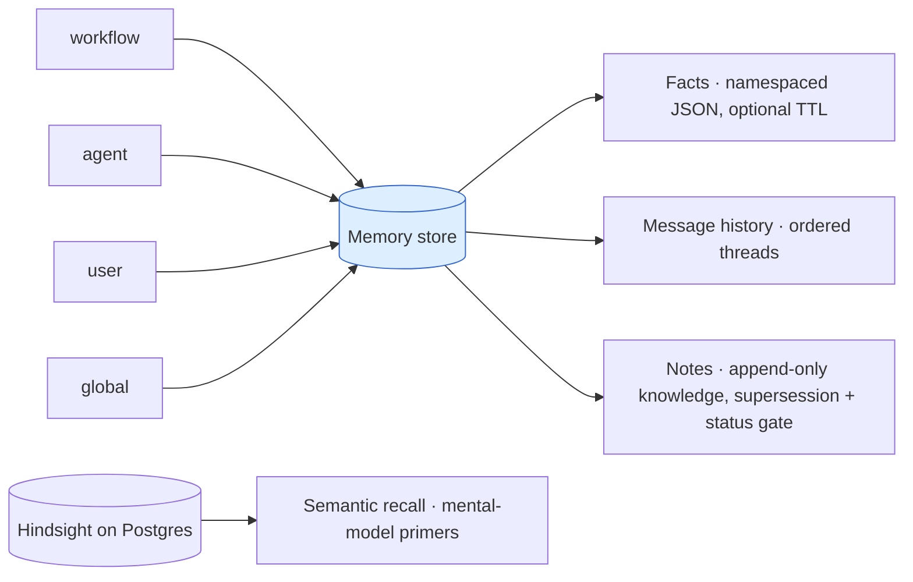

Memory persists state **across runs**. Task outputs are per-run; memory survives every workflow execution and can seed a new agent task with relevant context.

<Note>API reference: [Memory](/reference/memory) lists every memory export and type, its options, and links to source and tests.</Note>



## Four layers

```ts
import { createMemoryStore } from "smithers-orchestrator/memory";
import { Database } from "bun:sqlite";
import { drizzle } from "drizzle-orm/bun-sqlite";

const sqlite = new Database("smithers.db");
const db = drizzle(sqlite);
const store = createMemoryStore(db);
const ns = { kind: "workflow" as const, id: "code-review" };
```

| Layer | API | Use for |
|---|---|---|
| Facts | `store.setFact(ns, key, value, ttlMs?)` / `store.getFact(ns, key)` / `store.listFacts(ns)` / `store.listAllFacts()` | Namespaced JSON facts. Optional TTL. Last-write-wins. `listAllFacts()` returns every fact across all namespaces (what `memory list` prints with no namespace). |
| Message history | `store.createThread(ns, title?)`, `store.listThreads()`, `store.saveMessage(msg)`, `store.listMessages(threadId, limit)`, `store.deleteMessages(threadId, messageIds)` | Ordered chat threads per agent or user; list/delete to compact history. |
| Notes | `store.saveNote(input)` / `store.getNote(id)` / `store.listNotes(ns, filter?)` / `store.setNoteStatus(id, status)` / `store.enableNoteSearch(kind)` / `store.searchNotes(kind, query, limit?, filter?)` | Append-only knowledge (lessons, decisions, runbook rules). Notes die by supersession or rejection, not TTL. SQLite uses opt-in FTS5; Hindsight uses semantic recall. |
| Maintenance | `store.deleteExpiredFacts()` plus processors | TTL cleanup and history compaction. |

## Local SQLite or Hindsight

The `<Memory>` component has two operating modes. Without `HINDSIGHT_URL`, it uses the existing local SQLite facts store and keyword recall. With `HINDSIGHT_URL`, it uses Hindsight for semantic recall, mental-model primers, and retention. Hindsight stores its own data in Postgres 15 or later with pgvector, so it is documented and deployed as a Postgres-family feature.

| Capability | SQLite local (`HINDSIGHT_URL` unset) | Hindsight on Postgres (`HINDSIGHT_URL` set) |
|---|---|---|
| Exact facts, threads, messages, and notes | Transactional rows in local SQLite | The same transactional SQLite contract store, with best-effort Hindsight projection for semantic retrieval |
| Recall | Tag-scoped local keyword matching | TEMPR semantic, text, graph, and temporal retrieval with compound tag filters |
| Mental-model primers | Unavailable | Saved mental-model content fetched verbatim |
| Mid-task tools | `remember` and `recall` over local facts | `remember` and `recall` over Hindsight banks |
| Automatic retention | Local fact write | Async Hindsight retain with per-run document id and append mode |
| Workflow-state backend | SQLite, PGlite, or Postgres | SQLite, PGlite, or Postgres can call a remote service; embedded Hindsight requires `SMITHERS_BACKEND=postgres` |
| Failure behavior | Local store remains available | Recall failure logs a warning and runs without injection; retention never blocks task completion |

<Warning>
Use one `HindsightMemoryStore` writer instance per transactional contract store. The store serializes same-document projections only within one instance. Separate instances can project competing mutations out of order because they do not share a queue or a durable version fence.
</Warning>

The fallback is deliberate. A workflow that does not configure Hindsight keeps the existing SQLite facts behavior and does not acquire a Postgres dependency.
For PGlite and Postgres workflow-state backends, those fallback facts use the local `.smithers/smithers.db` sidecar; workflow state stays on the selected backend.

`HindsightMemoryStore` preserves the `MemoryStore` identity and concurrency contract in its authoritative transactional rows: fact identity is namespace plus key, while message and note ids remain global. Hindsight is a best-effort semantic projection, not the authoritative copy. A projection failure is logged and queued for another attempt while the process remains alive; it does not reject a contract-store mutation that already committed. The retry queue is not a durable outbox, so an interrupted process can leave Hindsight behind the contract store until the record is written or deleted again. Within one store instance, projections to the same remote document run in mutation order. That ordering does not extend across instances sharing one contract store. Exact facts use a stable document id derived from namespace plus key and `updateMode: "replace"`; threads, messages, and notes use typed retained documents. `searchNotes` and task recall call Hindsight `recall`, while exact reads and supersession filtering use the contract rows. Compound filters use `tag_groups` only. Stable branch, stream, source, and scope dimensions are tags. Volatile session and run identity stays in metadata and stable append document ids.

For a user bank plus a project bank, Smithers recalls the user bank without project filters and recalls the project bank through `(scope:main OR branch:current)`, with stream tags as additional constraints. Primer ids are searched across the configured banks; a missing bank/id pair does not discard primers found elsewhere. The local SQLite runtime applies the same strict tag scope before keyword ranking.

Every method has an Effect-returning twin (`store.listThreadsEffect`, `store.deleteMessagesEffect`, etc.) for use inside an Effect pipeline.

## Namespaces

```ts
type MemoryNamespace = { kind: "workflow" | "agent" | "user" | "global"; id: string };
```

Pick the kind to match the lifetime: `workflow` is scoped to a workflow definition; `agent` to an agent identity; `user` to an end user; `global` is shared across everything.

## Declarative task memory

```tsx
<Memory
  bank={`project-${ctx.input.repoId}`}
  tags={[
    ctx.input.branch === "main" ? "scope:main" : "scope:branch",
    `branch:${ctx.input.branch}`,
  ]}
  recall="auto"
  primers={["project-primer"]}
  retain="on-complete"
  tools
>
  <Task id="review" output={outputs.review} agent={reviewer}>
    Review the latest PR.
  </Task>
</Memory>
```

The provider configuration and the existing per-task `memory={...}` prop converge on `TaskDescriptor.memoryConfig`. A task prop replaces its inherited provider configuration. Before the task runs, the engine fetches primers and recall results, applies a conservative token cap to the complete fenced block, and prepends it to the prompt. The cap includes primers, recall rows, labels, and framing; it also applies to serialized `recall` tool results. Recall failures degrade to the original prompt. After a successful task, `retain="on-complete"` starts a non-blocking retain.

Tasks with an active `bank` or `banks` configuration bypass task-output caching. Recall is mutable input, and a cache hit would otherwise skip recall and return output produced from an older memory snapshot. Legacy-only memory metadata is inert and keeps the task's existing cache semantics. Smithers still freezes one fetched snapshot across retries of the same task execution.

Use stable tags for branches, streams, source, and scope. `scope:main` belongs only on `branch:main`; branch-local writes use `scope:branch`. When a project-bank configuration has one branch tag and no scope tag, Smithers derives the correct scope. A tagless project-bank write defaults to `scope:main`, so a later canonical recall can see it. Conflicting scope and branch tags are rejected. The 16-tag limit is checked after configured tags, tool tags, and automatic source/scope tags are merged. Run and session identities belong in retention metadata and document ids, where they preserve provenance without fragmenting consolidation.
Tags supplied to the mid-task `recall` tool only narrow the configured recall scope. They cannot replace the base project branch or stream filters.

See [`<Memory>`](/components/memory) for the complete prop table, multi-bank behavior, tool mode, and deployment configuration.

The legacy task shape remains valid:

```tsx
<Task
  id="review"
  output={outputs.review}
  agent={reviewer}
  memory={{
    recall: { namespace: ns, topK: 3 },
    remember: { namespace: ns, key: "last-review" },
    threadId: `${ctx.input.repo}:reviews`,
  }}
>
  Review the latest PR.
</Task>
```

Legacy `namespace`, object-form `recall`, `remember`, and `threadId` fields remain accepted and preserved on `TaskDescriptor.memoryConfig`, but the engine does not interpret them. They do not recall facts, retain task output, or append message history. Use the bank-based fields above for runtime memory, or call `createMemoryStore` directly for exact local facts, threads, and messages.

## Imperative get/set/delete inside a workflow

The `memory={{ recall, remember }}` legacy block is inert compatibility metadata. To get, set, or delete an exact fact from a compute `<Task>`, build a store with `createMemoryStore(db)` and call it directly. The compute callback receives `deps` only; there is no injected store, so you create one:

```tsx
import { createMemoryStore } from "smithers-orchestrator/memory";
import { Database } from "bun:sqlite";
import { drizzle } from "drizzle-orm/bun-sqlite";

const store = createMemoryStore(drizzle(new Database("smithers.db")));
const ns = { kind: "workflow" as const, id: "code-review" };

<Task id="remember-model" output={outputs.done}>
  {async () => {
    await store.setFact(ns, "model", "gpt-4");           // set
    const fact = await store.getFact(ns, "model");        // get (MemoryFact | undefined)
    const all  = await store.listFacts(ns);               // list
    await store.deleteFact(ns, "stale-key");              // delete
    return { done: true };
  }}
</Task>
```

Create the store once at module scope (outside the workflow) and reuse it across tasks rather than re-opening the SQLite handle in every task body. Under Effect, the same operations are available as `store.setFactEffect(ns, key, value, ttlMs?)`, `store.getFactEffect(ns, key)`, etc., or via `MemoryService` (`MemoryServiceApi`), which also exposes the underlying `.store`.


## Durable notes

Facts are a mutable scratch lane; **notes** are the durable knowledge lane.
A note's body, labels, and provenance never change after insert. Knowledge
evolves by **supersession**: a new note lists the ids it replaces, and the
superseded notes drop out of default reads only once the superseder is
**accepted**. `status` is the one mutable field: a human or workflow gate
flips it with `setNoteStatus`, so propose-then-reject leaves the original
knowledge untouched.

The **default read contract** (no filter) is a stability contract: reads
return notes that are accepted and not superseded by an accepted note.
Filters (`status`, `includeSuperseded`, `kind`, `namespace`) widen or narrow.

```ts
const ops = { kind: "user" as const, id: "ops-team" };

// Bank a lesson (append-only; provenance records which run learned it).
const lesson = await store.saveNote({
  namespace: ops,
  body: "Warm the cache tier before scaling deploys back up.",
  kind: "lesson",
  provenance: { runId: ctx.runId, nodeId: "bank" },
});

// Propose ONE rule that replaces piled-up lessons; pending hides nothing.
const rule = await store.saveNote({
  namespace: ops,
  body: "Always pre-warm caches after scale-down.",
  kind: "runbook-rule",
  status: "pending",
  supersedes: [lesson.id],
});

// The human gate: accepting the rule hides the lessons it replaces.
await store.setNoteStatus(rule.id, "accepted");

// Recall live knowledge only (accepted, not superseded).
const live = await store.listNotes(ops);
```

On SQLite, full-text search is **lazy and opt-in per namespace kind**: nothing
is indexed (and note writes pay nothing) until `enableNoteSearch(kind)`, which
creates the FTS index and backfills. On Hindsight, the transactional note row
is projected and indexed on write, so `enableNoteSearch` is a compatibility
no-op and `searchNotes` uses semantic recall before applying the contract
store's status and supersession rules. Search spans every namespace of the kind;
pass `{ namespace }` in the filter to stay namespace-local on a shared
backend. See
[`examples/incident-runbook-memory.jsx`](https://github.com/smithersai/smithers/blob/main/examples/incident-runbook-memory.jsx)
for the full recall → triage → bank → distill → ratify loop.

## Processors

Maintenance jobs you run periodically:

```ts
import { TtlGarbageCollector, TokenLimiter, Summarizer } from "smithers-orchestrator/memory";

const gc         = TtlGarbageCollector();   // expire facts past their TTL
const limiter    = TokenLimiter(4000);      // keep history under token budget
const summarizer = Summarizer(myAgent);     // compress old messages with an LLM

await gc.process(store);
await limiter.process(store);
await summarizer.process(store);
```


## Inspect from the CLI

```bash
bunx smithers-orchestrator memory list workflow:code-review -w workflow.tsx
```

The CLI currently exposes fact listing. Use the store API for writes, deletes, threads, messages, and TTL cleanup.

## Notes

- Memory and task outputs are **distinct stores**. Don't use memory for run-scoped state; it's not transactional with the workflow's frame commits.
- Working-memory writes are unordered. Use message history when sequence matters.
