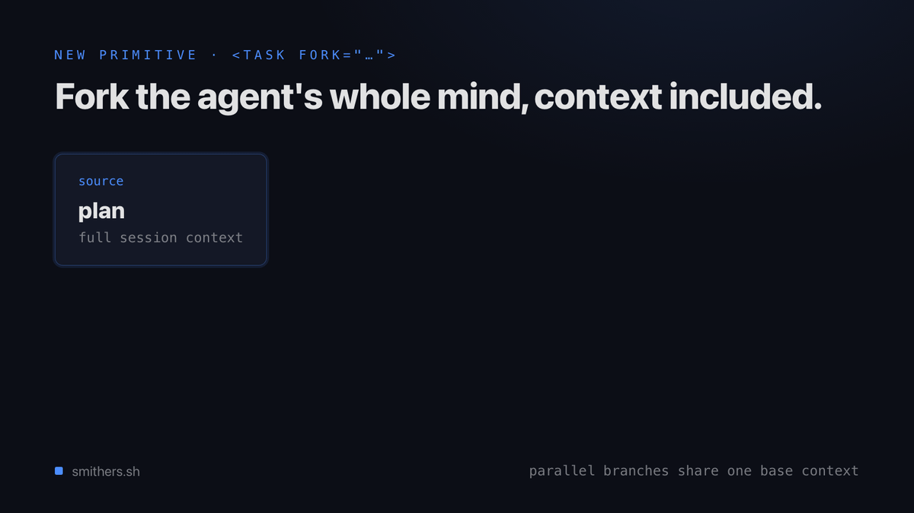
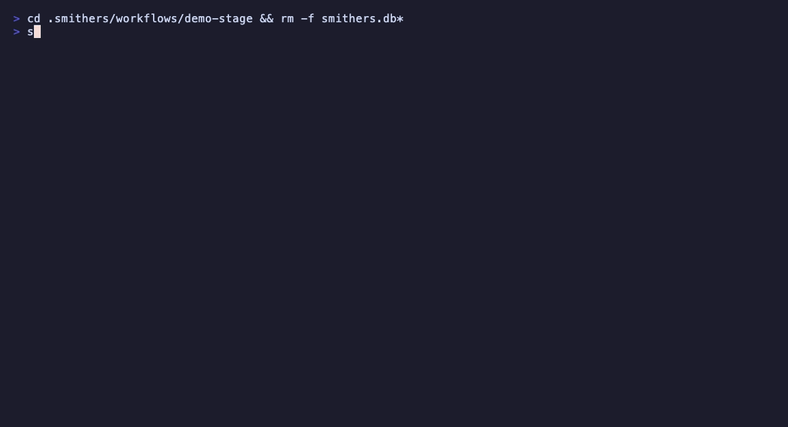
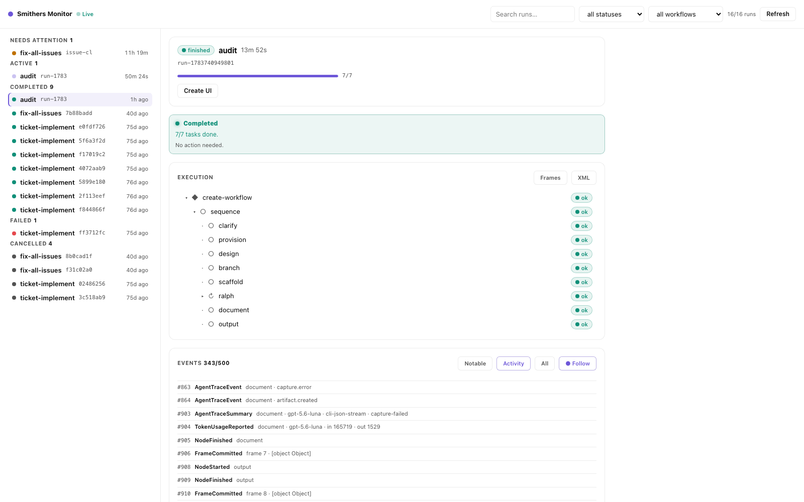

# Smithers

**Agent workflows you can watch live, rewind, fork, and replay.**

[](https://www.npmjs.com/package/smithers-orchestrator)
[](https://github.com/smithersai/smithers/actions/workflows/ci.yml)
[](#license)
[](https://smithers.sh)
[](https://github.com/smithersai/awesome-smithers)

Tell your coding agent to do real, multi-step work, then Smithers runs it for minutes or
days: watch every step live, gate the risky ones behind human approvals, and rewind,
fork, or replay any run. The same workflow runs across Claude Code, Codex, Pi, AI SDK
models, and remote sandboxes.

*Time travel: fork a run from any earlier frame and branch an alternate timeline. Every
step is a database row, so live watching, rewind, and replay are built in.*



## What you get

- ⏪ **Full observability and time travel**: watch every step live, then rewind, fork, or
  replay any run from any point.
- 🛡️ **Durable runs that survive crashes**: every completed step is persisted the moment it
  finishes, so a run resumes from where it stopped instead of starting over.
- 🔌 **Any agent, any model**: Claude Code, Codex, Pi, Antigravity, and more, plus any model
  through the AI SDK. Swap the harness without rewriting the workflow.
- 🛠️ **Higher-quality output**: review loops, human approvals, and evals give agents the
  structure that real work demands.
- 🧩 **Dozens of ready-to-run workflows**: planning, implementation, review, debugging,
  tickets, audits, and long-horizon missions. Your agent can author new ones.

## When to use Smithers

| You want to… | Smithers? |
| --- | --- |
| Get one answer from one prompt | No, call the model directly |
| Let a coding agent change a repo across many steps | **Yes** |
| Pause for a human approval, then resume later | **Yes** |
| Run several agents that review, retry, and converge | **Yes** |
| Survive crashes and replay, fork, or rewind a run | **Yes** |

Smithers is the durable runtime for *coding-agent* work: when the unit of work is an agent
editing a real repository over many steps, and you need that work to be inspectable,
approvable, and recoverable.

## Why not just let my agent orchestrate itself?

Claude Code, Codex, and the other harnesses already fan out subagents, and for work that
fits in one sitting they are the right tool. The fan-out is ephemeral, though: it lives
inside one session, one vendor, and one terminal.

| Built-in subagent fan-out | A Smithers run |
| --- | --- |
| Dies when the session ends or crashes | Persists and resumes from the last finished step |
| One vendor per session | Claude, Codex, Gemini, and Pi share one workflow |
| An approval blocks the terminal | An approval suspends the run durably, overnight if needed |
| A bad decision means starting over | Rewind, fork, or replay from any step |
| Orchestration is a prompt you retype | A workflow is a file you version, review, and rerun |

When the work has to survive the session, hand the fan-out to Smithers. Your agent still
drives everything; the run just stops being disposable. Detailed comparisons:
[vs. Claude Code Workflows](https://smithers.sh/why/vs-claude-code-workflows),
[vs. Temporal](https://smithers.sh/why/vs-temporal), and
[vs. LangGraph](https://smithers.sh/why/vs-langgraph). The longer argument is in
[the open, durable version of agent workflows](https://smithers.sh/why/durable-open-orchestration).

## Get started

Smithers is driven by your coding agent, **not** a GUI you click. Your agent runs Smithers
on your behalf: it scaffolds workflows, kicks off runs, watches them, and handles
approvals.

One command sets everything up. From inside your project:

```bash
bunx smithers-orchestrator init
```

`init` does everything:

- **Installs the `smithers` skill** into the coding agents on your machine (Claude Code,
  Pi, and more), so your agent knows how and when to use Smithers. No `mkdir`, no `curl`.
- **Scaffolds `.smithers/`** with ready-made workflows (`hello`, `implement`, `plan`,
  `review`, `debug`, and more) your agent can pick from.

Then just ask:

> *"orchestrate an agent to add rate limiting and keep iterating until the tests pass."*

Your agent picks the right workflow, starts the run, and keeps going through retries and
review loops until the work is actually done.

To wire the MCP server into every detected agent too, run `bunx smithers-orchestrator mcp
add`. See [Agent Support](https://smithers.sh/agents/overview) for the full per-agent
matrix, and [`skills/smithers/`](./skills/smithers) for the onboarding skill itself.

## What a workflow looks like

A workflow is a JSX tree of tasks. You usually don't write these by hand: you prompt your
agent, and it writes them from the same primitives the built-in pack uses. Each example
below starts with the prompt that produces it.

This page is the 90-second version. The **[Tour](https://smithers.sh/tour)** is the
15-minute version: it builds a real code-review workflow one capability at a time.

### Loop until a reviewer approves

> *"implement this request and keep iterating until a reviewer signs off"*

```tsx
import { createSmithers, Loop, CodexAgent } from "smithers-orchestrator";
import { z } from "zod";

const { Workflow, Task, smithers, outputs } = createSmithers({
  input: z.object({ request: z.string() }),
  impl: z.object({ summary: z.string(), filesChanged: z.array(z.string()) }),
  review: z.object({ approved: z.boolean(), feedback: z.string() }),
});

const coder = new CodexAgent({
  model: "gpt-5.6-luna",
  config: { model_reasoning_effort: "medium" },
});
const reviewer = new CodexAgent({
  model: "gpt-5.6-sol",
  config: { model_reasoning_effort: "xhigh" },
  sandbox: "read-only",
});

export default smithers((ctx) => (
  <Workflow name="implement-reviewed">
    <Loop until={ctx.latest(outputs.review, "validate")?.approved} maxIterations={5}>
      <Task id="implement" output={outputs.impl} agent={coder}>
        {`Implement: ${ctx.input.request}
Address this reviewer feedback first: ${ctx.latest(outputs.review, "validate")?.feedback ?? "none yet"}`}
      </Task>

      <Task id="validate" output={outputs.review} agent={reviewer}>
        {`Review the working-tree changes for: ${ctx.input.request}.
Approve only when the change is correct and tested.`}
      </Task>
    </Loop>
  </Workflow>
));
```

This is the loop a one-shot agent call can't give you: implement, review, feed the
feedback back in, repeat until approved. Every iteration is persisted, so a crash mid-loop
resumes at the current iteration instead of iteration one.

The bigger version of this idea (split a request into tickets, implement them in
parallel worktrees, gate on your approval, land through a merge queue) is
[`examples/parallel-tickets.jsx`](./examples/parallel-tickets.jsx): a small engineering
team in one file.

## Durable by default

Durability is the differentiator. Runs survive crashes, restarts, and flaky tools because
**every completed step is persisted to SQLite the moment it finishes**. The runtime always
knows what's done and what to run next. Approvals, human questions, retries, and replay are
first-class.

```text
prompt → render workflow → run task → validate output → persist to SQLite → re-render → resume · inspect · replay
```

That loop is the whole model: a task runs, its output is validated against a schema and
written down, then the workflow re-renders from persisted state to decide the next task. A
crash at any point resumes from the last write, not from the top.

*A run killed mid-task, then resumed: the completed task is skipped, the interrupted task
re-runs, the run finishes. No recovery code.*



```bash
bunx smithers-orchestrator up workflow.tsx --input '{"description":"Fix bug"}'
bunx smithers-orchestrator up workflow.tsx --run-id abc123 --resume true   # resume after a crash
bunx smithers-orchestrator rewind abc123 --frame 4                          # time-travel to an earlier frame
bunx smithers-orchestrator fork abc123                                      # branch an alternate timeline
bunx smithers-orchestrator replay abc123                                    # replay from a checkpoint
```

## Drive and watch your runs

Prefer the CLI? The seeded workflows run directly, and whether your agent started a run or
you did, you can see exactly what's happening:

```bash
bunx smithers-orchestrator workflow run hello   # smallest possible run; prompt lives at .smithers/prompts/hello.mdx
bunx smithers-orchestrator workflow run plan --prompt "add rate limiting and API key rotation"

bunx smithers-orchestrator ps              # list active, paused, and recently completed runs
bunx smithers-orchestrator inspect RUN_ID  # steps, agents, approvals, and outputs for one run
bunx smithers-orchestrator logs RUN_ID     # tail the event log
bunx smithers-orchestrator chat RUN_ID     # read the agent's chat output
```

`ps` shows you what needs attention (a paused approval, a recent failure); `inspect` drills
into a single run so you can follow each step and agent as it works. Run
`bunx smithers-orchestrator starters` to browse plain-English starters.

Prefer a live page over every run? `bunx smithers-orchestrator monitor` opens the Smithers
Monitor: the grouped run list, each run's execution tree with per-node status, and the
structured event stream underneath.



## Any agent, any model

Smithers doesn't bet on one lab or one harness. Point a task at whichever agent is best for
the job, mix several in one workflow, and switch freely. The workflow doesn't change when
the model does, so a frontier model can plan, a fast model can fan out, and a specialized
harness can do the edits.

**Agents that run tasks**

| Agent | How it runs |
| --- | --- |
| [Claude Code](./docs/integrations/cli-agents.mdx) | CLI harness |
| Codex | CLI harness |
| [Pi](./docs/integrations/pi-integration.mdx) | CLI harness |
| Antigravity | CLI harness |
| Any [AI SDK](./docs/integrations/sdk-agents.mdx) model | SDK agent, with tools, structured output, and MCP |

The same `<Sandbox>` primitive runs an agent locally (Bubblewrap, Docker) or on a
remote provider like [Freestyle](https://freestyle.sh) with no change to the workflow,
and the `SandboxProvider` interface accepts any backend you bring.

Beyond [`init`](#get-started), `bunx smithers-orchestrator mcp add` also wires the MCP
server into Cursor, Copilot, Hermes, OpenClaw, and ~20 more coding agents.

## Built-in workflows

`bunx smithers-orchestrator init` installs a pack of ready-to-run workflows: `implement`,
`plan`, `research`, `review`, `debug`, `tickets-create`, `kanban`, `mission`, `grill-me`,
`improve-test-coverage`, `audit`, `research-plan-implement`, and more. Point your agent at
one, or run it yourself:

```bash
bunx smithers-orchestrator workflow run implement --prompt "add rate limiting"
```

See [`docs/workflows/`](./docs/workflows/overview.mdx) for the full pack.

## Examples

The [`examples/`](./examples) folder has 100+ runnable workflows, one per orchestration
pattern. Copy one as a starting point:

[](./examples)

Review loops, parallel ticket fleets, supervisors, panels, debates, migrations, RAG
citation loops, repo janitors, and dozens more, each a runnable starting point.

## Also in the box

Smithers is built for agents that modify real repositories, so control is wired into
the runtime:

- **Approvals**: gate risky steps behind a human approve or deny before they run.
- **Isolation**: sandbox agents so edits never touch your host.
- **Observability**: Prometheus metrics and OpenTelemetry traces out of the box, plus a
  one-command local Grafana stack (`bunx smithers-orchestrator observability`).
- **Evals and prompt optimization**: repeatable regression suites, and GEPA-style tuning
  that rewrites prompts only when the score improves.
- **Hot reload**: edit prompts, config, or JSX mid-run; newly scheduled tasks pick up the
  changes.

## Read next

- [Tour](https://smithers.sh/tour): build a real code-review workflow in six steps.
- [Install the agent skill](./skills/smithers): make your coding agent fluent in Smithers.
- [How It Works](https://smithers.sh/how-it-works): the durable execution model.
- [Components](https://smithers.sh/components/workflow): the full primitive set.
- [Awesome Smithers](https://github.com/smithersai/awesome-smithers): community projects, workflow packs, examples, and integrations.

## Docs

Full documentation lives at **[smithers.sh](https://smithers.sh)**.

## License

MIT
