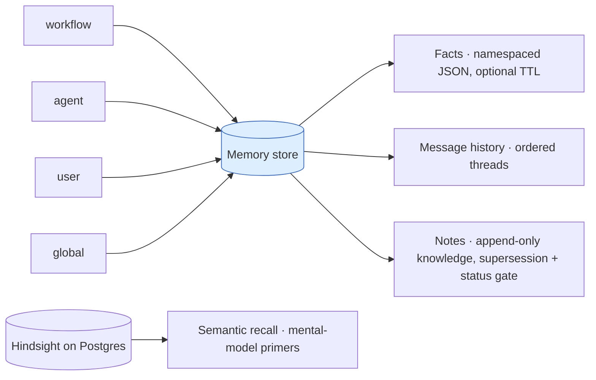

Memory persists state **across runs**, unlike per-run task outputs, and can seed a new agent task with relevant context.

<Note>API reference: [Memory](/reference/memory) lists every memory export and type, its options, and links to source and tests.</Note>



## Four layers

```ts
import { createMemoryStore } from "smthrs/memory";
import { Database } from "bun:sqlite";
import { drizzle } from "drizzle-orm/bun-sqlite";

const sqlite = new Database("smithers.db");
const db = drizzle(sqlite);
const store = createMemoryStore(db);
const ns = { kind: "workflow" as const, id: "code-review" };
```

| Layer | API | Use for |
|---|---|---|
| Facts | `store.setFact(ns, key, value, ttlMs?)` / `store.getFact(ns, key)` / `store.listFacts(ns)` / `store.listAllFacts()` | Namespaced JSON, optional TTL, last-write-wins. `listAllFacts()` returns every fact across all namespaces (what `memory list` prints with no namespace). |
| Message history | `store.createThread(ns, title?)`, `store.listThreads()`, `store.saveMessage(msg)`, `store.listMessages(threadId, limit)`, `store.deleteMessages(threadId, messageIds)` | Ordered chat threads per agent or user; list/delete to compact history. |
| Notes | `store.saveNote(input)` / `store.getNote(id)` / `store.listNotes(ns, filter?)` / `store.setNoteStatus(id, status)` / `store.enableNoteSearch(kind)` / `store.searchNotes(kind, query, limit?, filter?)` | Append-only knowledge (lessons, decisions, runbook rules) that dies by supersession or rejection, not TTL. SQLite uses opt-in FTS5; Hindsight uses semantic recall. |
| Maintenance | `store.deleteExpiredFacts()` plus processors | TTL cleanup and history compaction. |

## Local SQLite or Hindsight

The `<Memory>` component has two modes: without `HINDSIGHT_URL` it uses local SQLite facts and keyword recall; with it, Hindsight adds semantic recall, mental-model primers, and retention. Hindsight itself runs on Postgres 15+ with pgvector, so it's documented and deployed as a Postgres-family feature. `HINDSIGHT_URL` points at a Hindsight deployment the human has set up (Hindsight Cloud signup or a self-hosted Docker/Helm install); that human step is covered in [Set Up Semantic Memory](/guide/setup/semantic-memory).

| Capability | SQLite local (`HINDSIGHT_URL` unset) | Hindsight on Postgres (`HINDSIGHT_URL` set) |
|---|---|---|
| Exact facts, threads, messages, and notes | Transactional rows in local SQLite | Same transactional SQLite contract store, plus best-effort Hindsight projection for semantic retrieval |
| Recall | Tag-scoped local keyword matching | TEMPR semantic, text, graph, and temporal retrieval with compound tag filters |
| Mental-model primers | Unavailable | Saved mental-model content fetched verbatim |
| Mid-task tools | `remember` and `recall` over local facts | `remember` and `recall` over Hindsight banks |
| Automatic retention | Local fact write | Async Hindsight retain with per-run document id and append mode |
| Workflow-state backend | SQLite, PGlite, or Postgres | SQLite, PGlite, or Postgres can call a remote service; embedded Hindsight requires `SMITHERS_BACKEND=postgres` |
| Failure behavior | Local store remains available | Recall failure logs a warning and runs without injection; retention never blocks task completion |

<Warning>
Use one `HindsightMemoryStore` writer instance per transactional contract store: it serializes same-document projections only within that instance. Separate instances share no queue or durable version fence, so they can project competing mutations out of order.
</Warning>

The fallback is deliberate: skipping Hindsight keeps the existing SQLite facts behavior, with no Postgres dependency.
For PGlite/Postgres workflow-state backends, fallback facts still use the local `.smithers/smithers.db` sidecar while workflow state stays on the selected backend.

`HindsightMemoryStore` keeps `MemoryStore`'s identity and concurrency contract in its authoritative rows: fact identity is namespace plus key; message/note ids stay global. A failed projection logs and requeues while the process lives, never rejecting an already-committed mutation. The retry queue isn't a durable outbox: an interrupted process can leave Hindsight stale until the record is rewritten or deleted. Same-instance projections to one remote document run in mutation order; that ordering doesn't cross instances sharing a contract store. Exact facts get a stable document id from namespace+key and `updateMode: "replace"`; threads, messages, and notes use typed retained documents. `searchNotes` and task recall call Hindsight `recall`; exact reads and supersession filtering use the contract rows. `tag_groups` compound filters cover only stable tags (branch, stream, source, scope); session/run identity stays volatile, in metadata and append document ids.

With a user bank plus a project bank, Smithers recalls the user bank without project filters and the project bank through `(scope:main OR branch:current)` plus stream tags as constraints. Primer ids are searched across configured banks; a missing bank/id pair doesn't discard primers found elsewhere. The local SQLite runtime applies the same strict tag scope before keyword ranking.

Every method has an Effect-returning twin (`store.listThreadsEffect`, `store.deleteMessagesEffect`, etc.) for use inside an Effect pipeline.

## Namespaces

```ts
type MemoryNamespace = { kind: "workflow" | "agent" | "user" | "global"; id: string };
```

Pick the kind to match the lifetime: `workflow` is scoped to a workflow definition; `agent` to an agent identity; `user` to an end user; `global` is shared across everything.

## Declarative task memory

```tsx
<Memory
  bank={`project-${ctx.input.repoId}`}
  tags={[
    ctx.input.branch === "main" ? "scope:main" : "scope:branch",
    `branch:${ctx.input.branch}`,
  ]}
  recall="auto"
  primers={["project-primer"]}
  retain="on-complete"
  tools
>
  <Task id="review" output={outputs.review} agent={reviewer}>
    Review the latest PR.
  </Task>
</Memory>
```

Provider config and the per-task `memory={...}` prop both converge on `TaskDescriptor.memoryConfig`; a task prop replaces the inherited one. Before the task runs, the engine fetches primers and recall results, caps them conservatively (covering primers, recall rows, labels, framing, and serialized `recall` tool results), and prepends the block to the prompt. Recall failures degrade to the original prompt; a successful task with `retain="on-complete"` starts a non-blocking retain.

Tasks with an active `bank`/`banks` config bypass task-output caching: recall is mutable input, and a cache hit would otherwise skip it and return an older snapshot's output. Legacy-only memory metadata is inert and keeps the task's existing cache semantics; Smithers still freezes one fetched snapshot across retries of the same execution.

Use stable tags for branches, streams, source, and scope: `scope:main` belongs only on `branch:main`; branch-local writes use `scope:branch`. Given one branch tag and no scope tag, Smithers derives the correct scope; a tagless project-bank write defaults to `scope:main` so later canonical recall can see it. Conflicting scope/branch tags are rejected, and the 16-tag limit is checked after merging configured, tool, and automatic source/scope tags. Run and session identities instead belong in retention metadata and document ids, preserving provenance without fragmenting consolidation.
Tags supplied to the mid-task `recall` tool only narrow the configured recall scope; they cannot replace the base project branch or stream filters.

See [`<Memory>`](/components/memory) for the complete prop table, multi-bank behavior, tool mode, and deployment configuration.

The legacy task shape remains valid:

```tsx
<Task
  id="review"
  output={outputs.review}
  agent={reviewer}
  memory={{
    recall: { namespace: ns, topK: 3 },
    remember: { namespace: ns, key: "last-review" },
    threadId: `${ctx.input.repo}:reviews`,
  }}
>
  Review the latest PR.
</Task>
```

Legacy `namespace`, object-form `recall`, `remember`, and `threadId` fields remain accepted and preserved on `TaskDescriptor.memoryConfig`, but the engine ignores them: no fact recall, output retention, or message-history appends. Use the bank-based fields above for runtime memory, or call `createMemoryStore` directly for exact local facts, threads, and messages.

## Imperative get/set/delete inside a workflow

The `memory={{ recall, remember }}` legacy block is inert compatibility metadata. Get, set, or delete an exact fact from a compute `<Task>` by building a store with `createMemoryStore(db)` and calling it directly: the compute callback receives `deps` only, so there is no injected store.

```tsx
import { createMemoryStore } from "smthrs/memory";
import { Database } from "bun:sqlite";
import { drizzle } from "drizzle-orm/bun-sqlite";

const store = createMemoryStore(drizzle(new Database("smithers.db")));
const ns = { kind: "workflow" as const, id: "code-review" };

<Task id="remember-model" output={outputs.done}>
  {async () => {
    await store.setFact(ns, "model", "gpt-4");           // set
    const fact = await store.getFact(ns, "model");        // get (MemoryFact | undefined)
    const all  = await store.listFacts(ns);               // list
    await store.deleteFact(ns, "stale-key");              // delete
    return { done: true };
  }}
</Task>
```

Create the store once at module scope (outside the workflow) and reuse it across tasks rather than re-opening the SQLite handle in every task body. Under Effect, the same operations are available as `store.setFactEffect(ns, key, value, ttlMs?)`, `store.getFactEffect(ns, key)`, etc., or via `MemoryService` (`MemoryServiceApi`), which also exposes the underlying `.store`.


## Durable notes

Facts are a mutable scratch lane; **notes** are the durable knowledge lane.
A note's body, labels, and provenance never change after insert; knowledge
evolves by **supersession** instead: a new note lists the ids it replaces,
and the superseded notes drop out of default reads only once the superseder
is **accepted**. `status` is the one mutable field: a human or workflow gate
flips it with `setNoteStatus`, so propose-then-reject leaves the original
knowledge untouched.

The **default read contract** (no filter) is a stability contract: reads
return notes that are accepted and not superseded by an accepted note.
Filters (`status`, `includeSuperseded`, `kind`, `namespace`) widen or narrow.

```ts
const ops = { kind: "user" as const, id: "ops-team" };

// Bank a lesson (append-only; provenance records which run learned it).
const lesson = await store.saveNote({
  namespace: ops,
  body: "Warm the cache tier before scaling deploys back up.",
  kind: "lesson",
  provenance: { runId: ctx.runId, nodeId: "bank" },
});

// Propose ONE rule that replaces piled-up lessons; pending hides nothing.
const rule = await store.saveNote({
  namespace: ops,
  body: "Always pre-warm caches after scale-down.",
  kind: "runbook-rule",
  status: "pending",
  supersedes: [lesson.id],
});

// The human gate: accepting the rule hides the lessons it replaces.
await store.setNoteStatus(rule.id, "accepted");

// Recall live knowledge only (accepted, not superseded).
const live = await store.listNotes(ops);
```

On SQLite, full-text search is **lazy and opt-in per namespace kind**: nothing
is indexed, and note writes pay nothing, until `enableNoteSearch(kind)`
creates the FTS index and backfills. On Hindsight, the transactional note row
is projected and indexed on write, so `enableNoteSearch` is a no-op and
`searchNotes` uses semantic recall before applying the contract store's
status and supersession rules. Search spans every namespace of the kind;
pass `{ namespace }` to stay namespace-local on a shared backend. See
[`examples/incident-runbook-memory.jsx`](https://github.com/smithersai/smithers/blob/main/examples/incident-runbook-memory.jsx)
for the full recall → triage → bank → distill → ratify loop.

## Processors

Maintenance jobs you run periodically:

```ts
import { TtlGarbageCollector, TokenLimiter, Summarizer } from "smthrs/memory";

const gc         = TtlGarbageCollector();   // expire facts past their TTL
const limiter    = TokenLimiter(4000);      // keep history under token budget
const summarizer = Summarizer(myAgent);     // compress old messages with an LLM

await gc.process(store);
await limiter.process(store);
await summarizer.process(store);
```


## Inspect from the CLI

```bash
bunx smthrs memory list workflow:code-review -w workflow.tsx
```

The CLI currently exposes fact listing. Use the store API for writes, deletes, threads, messages, and TTL cleanup.

## Notes

- Memory is not transactional with the workflow's frame commits: don't use it for run-scoped state.
- Working-memory writes are unordered. Use message history when sequence matters.
