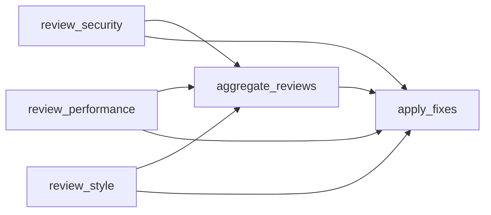

A realistic example of a multi-agent code review system with parallel reviewers, aggregated feedback, and human approval.

## Code

```python
from pydantic import BaseModel
from smithers import workflow, claude, require_approval, build_graph, run_graph


class SecurityReview(BaseModel):
    vulnerabilities: list[str]
    risk_level: str  # "none", "low", "medium", "high", "critical"
    recommendations: list[str]


class PerformanceReview(BaseModel):
    bottlenecks: list[str]
    complexity_score: int  # 1-10
    optimization_suggestions: list[str]


class StyleReview(BaseModel):
    violations: list[str]
    readability_score: int  # 1-10
    formatting_issues: list[str]


class AggregatedReview(BaseModel):
    total_issues: int
    critical_issues: list[str]
    should_block_merge: bool
    summary: str


class FixResult(BaseModel):
    issues_fixed: int
    files_changed: list[str]
    remaining_issues: list[str]


@workflow
async def review_security() -> SecurityReview:
    """Security-focused code review."""
    return await claude(
        "Review the codebase for security vulnerabilities.",
        tools=["Read", "Glob", "Grep"],
        system="You are a security expert.",
        output=SecurityReview,
    )


@workflow
async def review_performance() -> PerformanceReview:
    """Performance-focused code review."""
    return await claude(
        "Review the codebase for performance issues.",
        tools=["Read", "Glob", "Grep"],
        system="You are a performance engineer.",
        output=PerformanceReview,
    )


@workflow
async def review_style() -> StyleReview:
    """Style and readability review."""
    return await claude(
        "Review the codebase for style and readability.",
        tools=["Read", "Glob", "Grep"],
        system="You are a senior engineer focused on code quality.",
        output=StyleReview,
    )


@workflow
async def aggregate_reviews(
    security: SecurityReview,
    performance: PerformanceReview,
    style: StyleReview,
) -> AggregatedReview:
    """Aggregate all reviews into a single report."""
    return await claude(
        f"""
        Aggregate these code reviews:
        
        Security ({security.risk_level} risk):
        - {len(security.vulnerabilities)} vulnerabilities
        
        Performance (complexity: {performance.complexity_score}/10):
        - {len(performance.bottlenecks)} bottlenecks
        
        Style (readability: {style.readability_score}/10):
        - {len(style.violations)} violations
        """,
        output=AggregatedReview,
    )


@workflow
@require_approval("Apply automated fixes?")
async def apply_fixes(
    review: AggregatedReview,
    security: SecurityReview,
    performance: PerformanceReview,
    style: StyleReview,
) -> FixResult:
    """Apply automated fixes for issues found."""
    if not review.should_block_merge:
        return FixResult(
            issues_fixed=0,
            files_changed=[],
            remaining_issues=["No critical issues - skipping fixes"],
        )

    return await claude(
        f"""
        Apply fixes for these issues:
        
        Security: {security.vulnerabilities}
        Performance: {performance.bottlenecks}
        Style: {style.violations}
        """,
        tools=["Read", "Edit", "Bash"],
        output=FixResult,
    )


async def main():
    graph = build_graph(apply_fixes)

    print("Code Review Pipeline")
    print("=" * 50)
    print(graph.mermaid())
    print()
    print("Execution levels:")
    for i, level in enumerate(graph.levels):
        parallel = " (parallel)" if len(level) > 1 else ""
        print(f"  {i}: {', '.join(level)}{parallel}")

    result = await run_graph(graph)

    print(f"\nResults:")
    print(f"  Issues fixed: {result.issues_fixed}")
    print(f"  Files changed: {len(result.files_changed)}")
```

## Graph



## Execution Levels

```
Level 0: [review_security, review_performance, review_style]  ← All 3 in parallel!
Level 1: [aggregate_reviews]
Level 2: [apply_fixes]  ← Requires human approval
```

## Key Features

<CardGroup cols={2}>
  <Card title="Parallel Reviewers">
    Security, performance, and style reviews run concurrently
  </Card>
  <Card title="Aggregation">
    Results are combined into a single actionable report
  </Card>
  <Card title="Human Approval">
    Fixes require approval before execution
  </Card>
  <Card title="Tool Use">
    Claude reads and edits files directly
  </Card>
</CardGroup>

## Workflow

1. **Three parallel reviews** analyze the codebase from different angles
2. **Aggregation** combines findings and determines if merge should be blocked
3. **Human approval** is requested before applying fixes
4. **Automated fixes** are applied if approved
