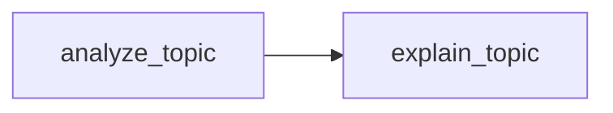

Demonstrates how workflows can depend on each other via type hints. Smithers automatically resolves the dependency graph.

## Code

```python
from pydantic import BaseModel
from smithers import workflow, claude, build_graph, run_graph


class AnalysisOutput(BaseModel):
    topic: str
    key_points: list[str]
    complexity: str  # "simple", "moderate", "complex"


class ExplanationOutput(BaseModel):
    summary: str
    analogy: str
    next_steps: list[str]


@workflow
async def analyze_topic() -> AnalysisOutput:
    """Analyze a technical topic."""
    return await claude(
        "Analyze the concept of 'dependency injection' in software engineering. "
        "Identify the key points and assess its complexity.",
        output=AnalysisOutput,
    )


@workflow
async def explain_topic(analysis: AnalysisOutput) -> ExplanationOutput:
    """Explain a topic based on prior analysis.
    
    Note: `analysis` is automatically provided by Smithers from `analyze_topic`.
    """
    return await claude(
        f"""
        Based on this analysis of '{analysis.topic}':
        
        Key points: {', '.join(analysis.key_points)}
        Complexity: {analysis.complexity}
        
        Create a beginner-friendly explanation with a relatable analogy.
        """,
        output=ExplanationOutput,
    )


async def main():
    # Build graph from the final workflow - deps are resolved automatically
    graph = build_graph(explain_topic)

    # Visualize what will run
    print("Execution plan:")
    print(graph.mermaid())
    print()

    # Execute
    result = await run_graph(graph)

    print(f"Summary: {result.summary}")
    print(f"\nAnalogy: {result.analogy}")
    print("\nNext steps:")
    for step in result.next_steps:
        print(f"  - {step}")


if __name__ == "__main__":
    import asyncio
    asyncio.run(main())
```

## Graph



## How Dependencies Work

The key is the type hint on `explain_topic`:

```python
async def explain_topic(analysis: AnalysisOutput) -> ExplanationOutput:
```

Smithers sees:
1. `explain_topic` needs `AnalysisOutput`
2. `analyze_topic` produces `AnalysisOutput`
3. Therefore: `analyze_topic` → `explain_topic`

No manual wiring required!

## Execution Order

```
Level 0: [analyze_topic]   # Runs first
Level 1: [explain_topic]   # Runs after, uses output from analyze_topic
```

## Output

```
Execution plan:
graph LR
    analyze_topic --> explain_topic

Summary: Dependency injection is a design pattern where a class receives 
its dependencies from external sources rather than creating them itself.

Analogy: Think of it like a restaurant kitchen. Instead of the chef going 
to the market to buy ingredients (creating dependencies), a supplier 
delivers exactly what's needed (injection). The chef can focus on cooking.

Next steps:
  - Try implementing a simple DI container
  - Learn about constructor vs setter injection
  - Explore DI frameworks like FastAPI's Depends
```
