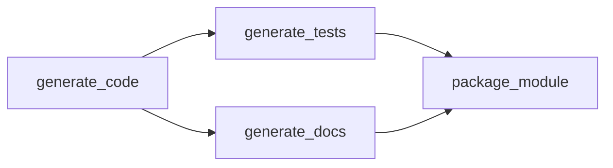

Demonstrates automatic parallelization when workflows have independent dependencies.

## Code

```python
from pydantic import BaseModel
from smithers import workflow, claude, build_graph, run_graph


class CodeOutput(BaseModel):
    code: str
    language: str
    description: str


class TestOutput(BaseModel):
    test_code: str
    test_count: int
    coverage_areas: list[str]


class DocsOutput(BaseModel):
    documentation: str
    examples: list[str]


class PackageOutput(BaseModel):
    summary: str
    files_created: list[str]
    ready_to_publish: bool


@workflow
async def generate_code() -> CodeOutput:
    """Generate a utility function."""
    return await claude(
        "Write a Python function called `retry_with_backoff` that retries "
        "a function with exponential backoff. Include type hints.",
        output=CodeOutput,
    )


@workflow
async def generate_tests(code: CodeOutput) -> TestOutput:
    """Generate tests for the code."""
    return await claude(
        f"""
        Write pytest tests for this {code.language} code:
        
        {code.code}
        
        Cover edge cases and error conditions.
        """,
        output=TestOutput,
    )


@workflow
async def generate_docs(code: CodeOutput) -> DocsOutput:
    """Generate documentation for the code."""
    return await claude(
        f"""
        Write documentation for this function:
        
        {code.code}
        
        Include usage examples and parameter descriptions.
        """,
        output=DocsOutput,
    )


@workflow
async def package_module(
    code: CodeOutput,
    tests: TestOutput,
    docs: DocsOutput,
) -> PackageOutput:
    """Package everything together."""
    return await claude(
        f"""
        Summarize this module package:
        
        Code: {code.description}
        Tests: {tests.test_count} tests covering {', '.join(tests.coverage_areas)}
        Docs: {len(docs.examples)} examples provided
        
        Is it ready to publish?
        """,
        output=PackageOutput,
    )


async def main():
    graph = build_graph(package_module)

    print("Execution Graph:")
    print(graph.mermaid())
    print()
    
    print("Execution levels (workflows in same level run in parallel):")
    for i, level in enumerate(graph.levels):
        print(f"  Level {i}: {', '.join(level)}")
    print()

    result = await run_graph(graph)

    print(f"Summary: {result.summary}")
    print(f"Ready to publish: {'✅' if result.ready_to_publish else '❌'}")


if __name__ == "__main__":
    import asyncio
    asyncio.run(main())
```

## Graph



## Execution Levels

```
Level 0: [generate_code]
Level 1: [generate_tests, generate_docs]  ← PARALLEL!
Level 2: [package_module]
```

- `generate_tests` and `generate_docs` both depend only on `generate_code`
- Neither depends on the other
- Therefore, they can run **in parallel**

## Timeline

```
t=0   generate_code starts
t=10  generate_code completes

t=10  generate_tests starts  ─┐
t=10  generate_docs starts   ─┼─ Same time!
t=18  generate_docs completes ┘
t=22  generate_tests completes

t=22  package_module starts
t=25  package_module completes
```

Total time: **25s** instead of **45s** (sequential)

## Key Insight

Smithers derives parallelism from the dependency graph. You don't need to specify what runs in parallel - it's automatic based on data dependencies.

<Tip>
Design your workflows to maximize parallelism. If two tasks don't depend on each other's output, they'll run concurrently.
</Tip>
