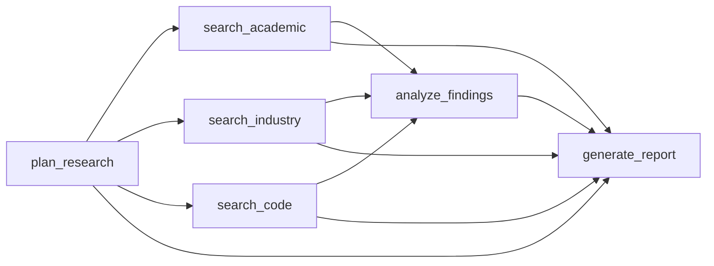

A deep research agent that plans research, executes parallel search streams, synthesizes findings, and generates a comprehensive report.

## Code

```python
from pydantic import BaseModel
from smithers import workflow, claude, build_graph, run_graph


class ResearchPlan(BaseModel):
    question: str
    sub_questions: list[str]
    search_strategy: str
    expected_sources: list[str]


class SearchResult(BaseModel):
    query: str
    findings: list[str]
    sources: list[str]
    confidence: float


class Analysis(BaseModel):
    key_themes: list[str]
    contradictions: list[str]
    gaps: list[str]
    strongest_evidence: list[str]


class Report(BaseModel):
    title: str
    executive_summary: str
    sections: list[str]
    conclusions: list[str]
    citations: list[str]
    confidence_score: float


@workflow
async def plan_research() -> ResearchPlan:
    """Create a research plan."""
    return await claude(
        """
        Create a research plan for:
        "What are the best practices for building reliable AI agent systems?"
        
        Break into sub-questions and identify sources to consult.
        """,
        output=ResearchPlan,
    )


@workflow
async def search_academic(plan: ResearchPlan) -> SearchResult:
    """Search academic sources."""
    return await claude(
        f"""
        Search academic sources on: {plan.question}
        Sub-questions: {plan.sub_questions[:2]}
        """,
        tools=["web_search", "read_web_page"],
        system="You are an academic researcher. Cite your sources.",
        output=SearchResult,
    )


@workflow
async def search_industry(plan: ResearchPlan) -> SearchResult:
    """Search industry sources."""
    return await claude(
        f"""
        Search industry sources on: {plan.question}
        Sub-questions: {plan.sub_questions[2:]}
        """,
        tools=["web_search", "read_web_page"],
        system="You are an industry analyst.",
        output=SearchResult,
    )


@workflow
async def search_code(plan: ResearchPlan) -> SearchResult:
    """Search code examples."""
    return await claude(
        f"""
        Search for code examples related to: {plan.question}
        Look for popular libraries and patterns.
        """,
        tools=["web_search", "read_web_page"],
        system="You are a developer researching implementations.",
        output=SearchResult,
    )


@workflow
async def analyze_findings(
    academic: SearchResult,
    industry: SearchResult,
    code: SearchResult,
) -> Analysis:
    """Synthesize all research findings."""
    return await claude(
        f"""
        Analyze these findings:
        
        Academic ({academic.confidence:.0%} confidence):
        {academic.findings}
        
        Industry ({industry.confidence:.0%} confidence):
        {industry.findings}
        
        Code ({code.confidence:.0%} confidence):
        {code.findings}
        
        Identify themes, contradictions, and gaps.
        """,
        output=Analysis,
    )


@workflow
async def generate_report(
    plan: ResearchPlan,
    analysis: Analysis,
    academic: SearchResult,
    industry: SearchResult,
    code: SearchResult,
) -> Report:
    """Generate final research report."""
    all_sources = academic.sources + industry.sources + code.sources
    avg_confidence = (
        academic.confidence + industry.confidence + code.confidence
    ) / 3

    return await claude(
        f"""
        Generate a research report on: {plan.question}
        
        Key themes: {analysis.key_themes}
        Strongest evidence: {analysis.strongest_evidence}
        Gaps: {analysis.gaps}
        
        Sources available: {len(all_sources)}
        Average confidence: {avg_confidence:.0%}
        """,
        output=Report,
    )


async def main():
    graph = build_graph(generate_report)

    print("Research Pipeline")
    print("=" * 50)
    print(graph.mermaid())
    print()
    print("Execution levels:")
    for i, level in enumerate(graph.levels):
        print(f"  {i}: {', '.join(level)}")

    result = await run_graph(graph)

    print(f"\n📄 {result.title}")
    print(f"\nExecutive Summary:\n{result.executive_summary}")
    print(f"\nConfidence: {result.confidence_score:.0%}")
    print(f"Citations: {len(result.citations)}")
```

## Graph



## Execution Levels

```
Level 0: [plan_research]
Level 1: [search_academic, search_industry, search_code]  ← All 3 in parallel!
Level 2: [analyze_findings]
Level 3: [generate_report]
```

## Pipeline Stages

<Steps>
  <Step title="Plan">
    Break the research question into sub-questions and identify source types
  </Step>
  <Step title="Search (Parallel)">
    Three specialized agents search academic, industry, and code sources simultaneously
  </Step>
  <Step title="Analyze">
    Synthesize findings, identify themes, contradictions, and gaps
  </Step>
  <Step title="Report">
    Generate a comprehensive report with citations and confidence score
  </Step>
</Steps>

## Key Features

- **Specialized Agents**: Each search agent has a different persona/expertise
- **Parallel Search**: All three searches run concurrently
- **Confidence Tracking**: Each source reports confidence, aggregated in final report
- **Web Tools**: Agents can search the web and read pages
