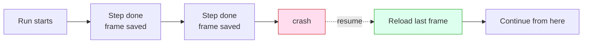

Six ideas, each one sentence, one picture, one thing you can say to your coding agent.

## 1. Durability: finished work stays finished

Every completed step is saved as a *frame*: crash mid-run and Smithers reloads the last one and continues, never re-running work that already succeeded. That's **render → execute → persist**. (Deep version: [How It Works](/how-it-works).)

<Frame caption="A run survives a crash mid-flight and picks up at the last completed step, with no re-doing finished work.">
  
</Frame>

> "Kick off the implement run. If my laptop sleeps, just resume it."

## 2. It loops until true, not once-and-done

Smithers runs implement → check → review until a condition is met, not one swing and done. One-shot output is where slop comes from; a real exit condition is what gets you quality.

> "Keep implementing and re-running the tests until they all pass."

## 3. Approvals: a paused run is just a row in a database

Put a human in the loop: a run waiting for approval is a paused row in SQLite, costing nothing, no process burning, no timer, no idle compute, whether it waits a day or a week. Approve, and it resumes exactly where it stopped.

> "Plan the migration, then pause for my approval before touching the database."

## 4. Time travel: rewind, fork, retry

Frames let you rewind to any earlier one, fork from there, and try a different approach without losing the original run: the first attempt becomes a branch you compare against, not a dead end. (Details: [How It Works](/how-it-works#time-travel).)

<Frame caption="One run forks into two from a saved frame, so a failed approach becomes a branch you can retry instead of a dead end.">
  
</Frame>

> "Rewind that run to before the refactor and try a different approach."

## 5. Any agent, any model

**Any agent, any model, any machine:** a frontier model plans while a cheaper one fans the work out, you pick the right brain for each step.

| Step | Good fit | Why |
|---|---|---|
| Plan / architect | A frontier model | Hard reasoning, one call, worth the cost |
| Fan-out implementation | Cheaper, faster models | Many parallel tasks, each small |
| Review / second opinion | A different model entirely | Independent eyes catch what the author missed |

<Frame caption="Plan with one model, implement with another, review with a third: Smithers routes each step to the model that fits it.">
  
</Frame>

> "Use a frontier model to plan, then fan the implementation out across cheaper models."

## 6. Isolation: parallel work doesn't collide

Each agent gets its own worktree or sandbox, so two editing the same repo don't trample each other and the results merge back cleanly: ten tickets, ten worktrees, ten agents, no shared mutable mess. The `kanban` workflow does exactly this.

<Frame caption="The three-layer stack (your agent on top, the Smithers runtime in the middle, isolated execution underneath) is what keeps parallel agents from colliding.">
  
</Frame>

> "Work all the open tickets at once, each in its own branch."

## The one rule above all six: you drive it through your agent

You never hand-write any of this. You describe the work in plain English, and **driving it through your agent** is what renders the loop, the gate, the fan-out, the isolation. These six are the vocabulary for asking for exactly the run you want.

## Read next

<CardGroup cols={2}>
  <Card title="Talk to your agent" icon="comments" href="/guide/talk-to-your-agent">
    **How-to:** how the conversation works, what to say, what comes back.
  </Card>
  <Card title="What you can do" icon="list-check" href="/guide/what-you-can-do">
    **Reference:** curated authoring workflows, archived examples, the kinds of work you can hand off.
  </Card>
  <Card title="How It Works" icon="gear" href="/how-it-works">
    **Explanation (deeper):** the render, execute, persist loop, frames, and resume, in detail.
  </Card>
  <Card title="Why React?" icon="code" href="/why-react">
    **Explanation (deeper):** why a JSX runtime, and why time travel comes for free.
  </Card>
</CardGroup>
