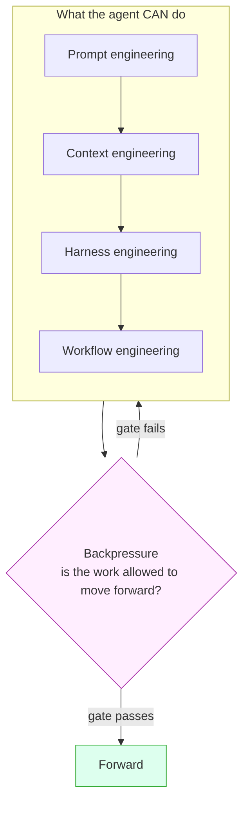

Writing a better prompt is the smallest lever: reliably finishing real work is a
**layered control system** living mostly *around* the model, not inside the prompt.
Smithers owns those outer layers so you can describe an outcome and let the system
assemble the rest.

## The layers

| Layer | What it controls | Where it lives in Smithers |
| --- | --- | --- |
| **Prompt engineering** | instructions, examples, role, output format, success criteria | the prompt `.mdx` a `<Task>` renders |
| **Context engineering** | what information, tools, memory, schemas, and state enter the model each step | the workflow graph + [memory](/how-it-works) + typed outputs |
| **Harness engineering** | runtime, tools, conventions, permissions, retries, fresh-context loops | `agents.ts`, [sandboxes](/components/sandbox), tools, `repoCommands` |
| **Workflow engineering** | order, parallelism, review loops, approvals, resumability, artifacts | the Smithers runtime itself |
| **Backpressure** | every desired behavior becomes a gate, test, eval, schema, reviewer, approval, or loop condition | Zod outputs, `bunx smthrs eval`, `<ReviewLoop>`, `<Approval>`, traces |

The first four shape what the agent *can* do; **backpressure** decides whether it's
allowed to move forward. A workflow that just tries its best and moves on has no
backpressure: that's where unreliable agents come from.



## Backpressure, concretely

Turn each success criterion into a verification signal, and pick the Smithers
primitive that enforces it:

- **Schema**: the step must return a shape: a Zod `output={...}` on the `<Task>`.
- **Test**: generated code must pass: a function task shelling out to `repoCommands.test`.
- **Eval**: an answer must satisfy examples/rubrics: `bunx smthrs eval` + [scorers](/guides/evals-quickstart).
- **Review**: another agent (or human) must approve: [`<ReviewLoop>`](/components/loop) / `<Panel>`.
- **Approval**: a human signs off before a risky action: [`<Approval>`](/components/approval).
- **Dependency**: step B can't start until step A produced a field: gate on `ctx.outputMaybe(...)`.
- **Trace**: tool calls, retries, and handoffs must be visible: [observability](/guides/evals-quickstart) + `bunx smthrs events`.

Loop until the gate passes (`<Loop>` / `<Ralph until={…}>`) rather than running once
and hoping.

Command gates should classify failure evidence before marking work red: a
typecheck is red only on `tsc --noEmit` diagnostics like `error TS...`, and a test
run is red only on an actual failed-test report. A nonzero exit, signal, OOM, or
timeout with no such evidence is infrastructure failure, not proof the patch is
bad: retry with more headroom instead of surfacing it as red.

## Sequence for reversibility; isolate the irreversible

Order the work so reversible, low-stakes steps run first and the irreversible side
effect runs last, behind a gate: everything before it is safe to retry, replay, or
discard. The wire transfer, the production deploy, the email to every customer:
steps you can't take back, so push them to the end and guard them.

The sharper rule: split the decision from the act. An agent that both decides to
send money and sends it fuses a reversible step with an irreversible one: you
can't review or rerun the decision without risking the send. Don't let the agent
send the money: have it return a typed decision, and make the payout its own
downstream task behind an approval gate:

```tsx
// Reversible: cheap to review, safe to retry, replays deterministically.
<Task id="decide-payout" output={outputs.payout} agent={analyst}>
  Should we release the vendor payout? Return shouldPay, amount, and a reason.
</Task>;

// Irreversible: its own task, the only step that touches money, gated by a human.
const payout = ctx.outputMaybe(outputs.payout, { nodeId: "decide-payout" });
payout?.shouldPay && (
  <Sequence>
    <Approval
      id="payout-gate"
      output={outputs.payoutGate}
      request={{ title: `Release $${payout.amount}?`, summary: payout.reason }}
    />
    <Task id="send-payout" output={outputs.receipt} agent={treasury}>
      Wire ${payout.amount} to the vendor, keyed for idempotency.
    </Task>
  </Sequence>
);
```

This buys four things a fused step cannot: a typed decision you can read, score,
and replay; an act that's its own graph node, visible in traces and independently
approvable; a human confirming the exact amount before money moves; and a side
effect that stays idempotent on retry, since the tool it calls is marked
`sideEffect: true` and keyed with `ctx.idempotencyKey` (see [Mark side-effecting
tools and key
them](/guides/common-footguns#mark-side-effecting-tools-and-key-them)). Same move
a database makes: do everything reversible, then commit once.

## A model call is stateless; context is the only control surface

For a fixed model, output quality is a function of one input: the context window
you hand it. The model keeps nothing between calls: each starts from zero, reading
only what's put in front of it. So "get a better result" means "manufacture a
better context window," and an agent is a loop that does exactly that, over and
over.

Every tool an agent runs is one of three context moves:

1. **Delete incorrect context.** The worst kind to leave in: a wrong fact or dead
   path becomes a false anchor the model tunnels toward. Distill a failed attempt
   to one line ("tried X, failed because Y, do not repeat") and drop the rest.
2. **Add missing context.** What tools are for: a test run, a diff, a stack trace,
   a file read, each turning an unknown into tokens to reason over. Without tools
   an agent guesses; with them, it looks.
3. **Remove useless context.** Residue is a tax: a finished task's output is
   adversarial noise for the next one. Rule of thumb: if you could `/clear`, you
   should.

Compression scales all three at once: a good summary deletes the wrong, keeps the
missing, and discards the useless in one pass.

## Three levers, and they trade off

Three things you can optimize, and pushing one usually costs another; naming them
keeps you honest about which one you're spending on.

- **Quality.** More attempts, more model diversity, more verification: three
  planners beat one, a review loop beats a single pass.
- **Cost.** Cheaper models wherever an eval proves they're good enough: prove it,
  then promote the cheap model on the strength of the score.
- **Speed.** Parallelism, and refusing to block fast work behind a slow sibling.

Smithers gives you a primitive per lever: `<Panel>` and `<ReviewLoop>` buy quality;
`<Sidecar>` buys cost by running a cheap shadow model next to the primary task,
scoring both with the same scorer, and reporting the delta without touching the
result, so you see when the cheap model is ready to promote; `<Parallel>` buys
speed.

The quality lever has a worked example in this repo:
[`examples/swe-evo/workflow/swe-evo-panel.tsx`](https://github.com/smithersai/smithers/blob/main/examples/swe-evo/workflow/swe-evo-panel.tsx).
It plans with a model-diverse `<Panel strategy="synthesize">` (three planners draft
independent plans, a moderator synthesizes one), then implements inside a
`<ReviewLoop>` that loops until the reviewers approve. The reviewer approval is a
proxy for the hidden test suite, so the loop climbs toward a signal it cannot see
directly.

## Hill climbing, two hills

An agent improves by climbing; the second hill pays more than the first.

The obvious hill is the **output**: generate, critique, regenerate, write the code,
run the reviewer, fix what it flagged. `<ReviewLoop>` and `<Optimizer>` make this
loop durable: each pass is a persisted frame, so a crash resumes mid-climb instead
of restarting.

The higher-leverage hill is the **context**: before the next attempt, ask "what
information would make this attempt obviously better?" and go get it, a failing
test, the actual file instead of a guess, a synthesized plan instead of a cold
start. The swe-evo panel climbs both at once: it manufactures a better context (a
synthesized plan) before the first line of code, then the review loop climbs the
output after.

## The smart zone

Agents perform best under about 200k tokens of context, noticeably better under
100k; past that, attention thins and quality drops. Give an agent a goal it can
finish inside that budget, with research and planning already done, so its window
goes to the work, not discovery: that's why a research step and a plan step
precede implementation, keeping the implementer in the smart zone.

Smithers measures the zone so you are not guessing:

- `smithers.tokens.context_window_per_call` is a histogram of per-call context
  size, bucketed at exactly `[50k, 100k, 200k, 500k, 1M]`.
- `smithers.tokens.context_window_bucket_total` is a counter of how many calls
  landed in each bucket, so you can see drift toward the large buckets.
- Per-node usage shows in `bunx smthrs node`, and live as the
  `TokenUsageReported` event (the 🧮 line in the event stream).

The in-workflow guardrail is [`<Aspects tokenBudget>`](/components/aspects),
enforced at task dispatch: before each descendant task runs, the engine compares the
run's accumulated token total against `max` and applies `onExceeded` (`fail` raises
`ASPECT_BUDGET_EXCEEDED`, `warn` logs and continues, `skip-remaining` skips the
task). A budget breach is a real, catchable error, which is what makes the durable
`/clear` below possible.

## Plan the validation, not the feature

Your scarcest resource is deciding how you will *know* it worked: spend it where
it's cheapest.

Pipeline stages cost wildly different amounts to review. Vibe-checking a finished
output is near free and lets debt pile up unseen; reading a 500-line diff is
miserable, you'll skim it; reading a *plan*, a page of intent before any code
exists, is cheap and high leverage. Put your eyeballs where they're cheapest:
review the plan, test the output, skip the diff.

This only works with two things in place:

- **Plans with teeth.** The plan names the tests, the acceptance criteria, and the
  machine-checkable definition of done. A plan that says "implement the feature" has
  no teeth and gates nothing.
- **Real backpressure.** Tests, CI, and types push back on the agent directly. The
  agent feels resistance from the toolchain, not from you squinting at a diff at
  11pm.

A complex feature attempted cold one-shots maybe 40% of the time; the same
feature, preceded by a vetted plan with teeth and backed by real gates, one-shots
around 98%.

## Goal-based over ambiguous tasks

Write tasks around validation criteria, leaving implementation details out unless
a planning step already worked them out (then pass them down to save the
implementer's context). Measurable goals are best: "the suite passes", "the score
clears 0.9", "the schema validates"; a genuinely fuzzy goal can be "a reviewer
approves", preferring an agent reviewer over a human one so the loop stays
autonomous.

The validation prompt deserves as much thought as the work prompt: a sloppy
reviewer prompt is a broken feedback channel, and the agent will happily climb
toward the wrong summit.

## Observability is non-negotiable

An agent must always be able to self-validate and debug: it needs a test signal, a
trace, a real error to read. Treat a missing or broken channel as fatal, stop and
fix it: don't keep optimizing against a phantom signal, or the agent will produce
confident work that satisfies a metric you can't trust. When you build a feature,
invest in the observability the next agent will need to debug it.

## The testing bar is higher for agentic code

Never consider a feature working without an end-to-end test that proves it: an
agent that can't run the whole path can't tell whether it's done. Unit tests still
earn their place (TDD works well on small, self-contained snippets), but the e2e
test is what closes the loop.

A direct consequence: break the work into vertical slices, covered next.

## Break up tasks into vertical slices

When you decompose a system into tasks, cut it like this: boilerplate horizontally,
features vertically. Early tasks scaffold each level of the stack, the frontend
shell, the API skeleton, the database schema and migrations, because boilerplate is
uniform, low-risk, and parallelizes cleanly. Every task after that should be a
feature implemented end to end through all the levels, never a layer implemented
across all the features.

Two reasons the vertical cut wins for agents:

- **Backpressure is easier to implement.** A vertical slice terminates in behavior
  a real e2e test can prove, so the gate writes itself: the checkout flow either
  completes or it doesn't. A horizontal slice (a whole service layer for every
  feature at once) has nothing real to validate until the final layer lands,
  exactly when you want validation to have been happening all along.
- **Context stays colocated.** One feature's frontend, API handler, and schema
  decisions live together in a single context window, so the agent holds the whole
  path it is building. Split a feature across layer tasks and its context scatters
  across windows: each task re-derives the others' contracts from scratch, and the
  drift between them surfaces only at integration, the most expensive place to
  find it.

## Attention is finite; delegate the periphery

Keep linters, style guides, commit-message crafting, and the rest of the periphery
out of the primary agent's attention: push them to cheaper models in separate
passes with fresh, clean context. For version control, lean on Smithers's automatic
jj snapshotting instead of spending agent attention on git mechanics.

This generalizes into **sandwich delegation**: smart, expensive agents plan and
review at the two ends, cheaper agents implement in the middle, recursively as the
work grows (a capable model can write a Smithers script whose `<Panel>` plans with
two strong models and whose `<ReviewLoop>` validates, while cheaper models
implement in between). The more cost-insensitive you are, the more of the middle
you can hand to a strong implementer, but never spend your most expensive model on
work a cheaper one can do without reason.

## The lifeline rule: protect the orchestrator's own context

The orchestrator driving a long run is the one context alive for the whole job:
every sub-agent is disposable, it is not. That makes its context window the scarce
resource, and the failure mode is quiet: it reads a 4,000-line diff to "check the
work," ingests a run's full event log to debug, opens three candidate branches to
pick a winner, and now every downstream decision comes from a window full of
residue.

So never read large material into the orchestrator's own context: spawn a
throwaway sub-agent to read the diff, the log, or the file, and have it hand back
one paragraph. Judging is a read too, to pick the best of N candidates, spawn a
fresh verifier that ranks them and returns a verdict rather than pulling N diffs
into your window: the agent that stays clean shouldn't also hold every artifact.
`<ReviewLoop>`, `<Panel>`, and `<ScanFixVerify>` exist so verification lives apart
from the thing being verified. Keep the orchestrator lean and it runs all day;
pollute it and the whole job degrades from the top down.

## Re-read your instructions to fight drift

A long session drifts from its instructions the same way it drifts out of the
smart zone: fifty turns in, the goal has blurred, the plan has a dozen amendments,
and the operating rules you started with have quietly stopped being followed. You
reach for the expensive model on cheap work, call a diagnosis "done," let scope
creep in: the residue doesn't announce itself.

The cheap fix: re-read. Every few steps of a long job, and always after a
`<ContinueAsNew>` handoff, re-read the spec or goal and this doctrine, then check
recent behavior against them: right model tier, evidence bar actually enforced,
still solving the stated problem. Drift you catch yourself costs a re-read; drift
the human catches costs a day, which is why durable `/clear` re-injects the
distilled goal on every fresh window: a clean context that's forgotten its
instructions is only half the fix.

## POC in the planning phase

A throwaway proof of concept is a fast way to surface the ideas a plan needs. It
optimizes for speed and cost, never quality, since you're going to discard it:
only the lessons survive, and those feed the plan. Treating a POC as production
code is the trap: build it, learn from it, delete it, then plan.

## Don't over-granularize

Splitting a goal into a dozen babysat micro-tasks is micromanagement: it costs you
the agent's own judgment about how to get there. Give an agent a goal it can
achieve inside the smart zone and let it figure out the how; when the goal's too
big for one window, orchestrate several agents toward it rather than scripting
every step of one. Task size scales with agent power: a weaker model takes a
smaller bite, a strong model a larger one.

## Durable "/clear": a context handoff

A long-running loop accumulates context the way a chat session does; once it
drifts out of the smart zone, every later turn gets worse. The human fix is
`/clear`: drop the residue, keep the few facts that still matter, start fresh.

You can make that automatic and durable by composing three primitives:

- `<Aspects tokenBudget>` sets a hard ceiling on the loop's context; a breach
  throws `ASPECT_BUDGET_EXCEEDED`.
- `<TryCatchFinally catchErrors={["ASPECT_BUDGET_EXCEEDED"]}>` catches exactly that
  code instead of failing the run.
- The catch branch renders `<ContinueAsNew state={...} />`, which closes the current
  run and opens a fresh one carrying only the distilled state, back inside the smart
  zone with no residue.

The code below is the real
[`examples/context-handoff/workflow.tsx`](https://github.com/smithersai/smithers/blob/main/examples/context-handoff/workflow.tsx),
so `bunx smthrs graph examples/context-handoff/workflow.tsx --input '{}'`
renders its graph (including the catch branch) and `check-docs` verifies every import
here against the real package facade. That runnable file is the anti-rot teeth: if the
API drifts, the graph render and the typecheck fail.

```tsx
/** @jsxImportSource smthrs */
/**
 * Durable "/clear": a context handoff.
 *
 * Agents perform best in the smart zone (under ~200k tokens of context, ideally
 * under ~100k). A long-running loop accumulates context the way a chat session
 * does, and once it drifts out of the smart zone every later turn gets worse.
 * The fix a human does by hand is `/clear`: drop the accumulated residue, keep
 * the few facts that still matter, start fresh.
 *
 * This workflow does that automatically and durably. The pieces:
 *
 *   <Aspects tokenBudget>        a hard token ceiling for the subtree. The
 *                                engine enforces it at task dispatch; a breach
 *                                throws ASPECT_BUDGET_EXCEEDED.
 *   <TryCatchFinally>            an error boundary that catches exactly that
 *                                code and renders the catch branch instead of
 *                                failing the run.
 *   <ContinueAsNew state={...}>  the catch branch. It closes this run and opens
 *                                a fresh one carrying ONLY the distilled state,
 *                                so the new run starts back inside the smart
 *                                zone with no residue.
 *   <Loop>                       the little while loop that does the work. Each
 *                                pass makes one increment of progress until the
 *                                goal is met.
 *
 * Run the graph without executing it:
 *
 *   bunx smthrs graph examples/context-handoff/workflow.tsx --input '{}'
 *
 * The DAG includes the catch branch, so the render proves the whole handoff
 * wiring compiles.
 */

import { createSmithers, ClaudeCodeAgent } from "smthrs";
// In-repo, "smthrs" resolves to a limited examples entry that
// does not re-export <Aspects>/<TryCatchFinally>; import them from the
// components package directly. End-user code can import both from
// "smthrs".
import { Aspects, TryCatchFinally } from "@smthrs/components";
import { dirname, join } from "node:path";
import { fileURLToPath } from "node:url";
import { z } from "zod/v4";

const here = dirname(fileURLToPath(import.meta.url));

/** The minimal context we carry across a handoff. This, and only this, is what
 *  survives a `/clear`: the goal, which generation we are on, the last summary,
 *  and a short list of durable learnings (distilled wrong paths, not raw logs). */
type DistilledState = {
  goal: string;
  generation: number;
  lastSummary: string;
  learnings: string[];
};

export const schemas = {
  // One increment of work. `learnings` are distilled facts worth carrying
  // forward ("tried X, failed because Y"); `done` ends the loop.
  step: z.object({
    summary: z.string().default(""),
    learnings: z.array(z.string()).default([]),
    done: z.boolean().default(false),
  }),
};

// A local, gitignored DB next to this file so `smithers graph` never touches
// the project's smithers.db.
const api = createSmithers(schemas, { dbPath: join(here, "smithers.db") });
const { smithers, Workflow, Task, Loop, ContinueAsNew, outputs } = api;

// Autonomous agent: bypass flags on, no pinned cwd (that would override a
// <Worktree>). Graph rendering does not run the agent; these are the real
// flags a live run needs.
const worker = new ClaudeCodeAgent({
  model: "claude-opus-5",
  permissionMode: "bypassPermissions",
  dangerouslySkipPermissions: true,
});

const MAX_CONTEXT_TOKENS = 150_000;

export default smithers((ctx) => {
  // ctx.input fields arrive raw-or-null, so coalesce every read. The carried
  // state arrives under the continuation envelope on a handoff; on a cold start
  // it is absent and we read the top-level goal instead.
  const input = (ctx.input ?? {}) as {
    goal?: string | null;
    __smithersContinuation?: { payload?: Partial<DistilledState> | null } | null;
  };
  const carried = input.__smithersContinuation?.payload ?? null;
  const goal = carried?.goal ?? input.goal ?? "Make the failing test suite pass.";
  const generation = (carried?.generation ?? 0) + 1;

  // Read this generation's progress out of typed outputs (empty on a fresh
  // render). The loop is done when the last step says so.
  const steps = ctx.outputs.step ?? [];
  const lastStep = steps[steps.length - 1];
  const done = lastStep?.done === true;

  // Distill the state we would hand off: the goal, the next generation number,
  // the latest summary, and the last 10 learnings. Capped on purpose, so the
  // fresh run starts small and back inside the smart zone.
  const distilled: DistilledState = {
    goal,
    generation,
    lastSummary: lastStep?.summary ?? carried?.lastSummary ?? "",
    learnings: [...(carried?.learnings ?? []), ...(lastStep?.learnings ?? [])].slice(-10),
  };

  const prompt = [
    `Goal: ${goal}`,
    carried
      ? `Fresh context, generation ${generation}. Prior summary: ${distilled.lastSummary || "(none)"}.`
      : "Fresh start.",
    distilled.learnings.length
      ? `Known so far:\n${distilled.learnings.map((l) => `- ${l}`).join("\n")}`
      : "",
    "Make one increment of progress. Report a short summary, any durable learnings (distill wrong paths to 'tried X, failed because Y'), and set done=true only when the goal is fully met.",
  ]
    .filter(Boolean)
    .join("\n\n");

  return (
    <Workflow name="context-handoff">
      <Aspects tokenBudget={{ max: MAX_CONTEXT_TOKENS, onExceeded: "fail" }}>
        <TryCatchFinally
          catchErrors={["ASPECT_BUDGET_EXCEEDED"]}
          catch={<ContinueAsNew state={distilled} />}
          try={
            <Loop id="work" until={done} maxIterations={50}>
              <Task id="step" output={outputs.step} agent={worker}>
                {prompt}
              </Task>
            </Loop>
          }
        />
      </Aspects>
    </Workflow>
  );
});
```

## Smithers does the context engineering for you

You should not need to know any of the above to get a workflow: the
[`create-workflow`](/workflows/create-workflow) workflow is the entry point to the
"context engineering for you" layer.

```bash
bunx smthrs workflow run create-workflow \
  --prompt "Watch a landing request and auto-land it once CI is green"
```

It clarifies your ask into a spec, **provisions the docs and skills the work needs**
(pulls the relevant `llms-*.txt`, finds the closest `examples/` template, and
installs worker skills via `bunx smthrs skills add`), designs the graph, pauses for
your approval, scaffolds the files, verifies the graph renders, and documents the
result. You answer product questions; it produces the prompts, context, components,
and gates.

This is the direction Smithers is heading: a concierge that takes a vague script,
interrogates it, routes it to the right skills and workflows, adds backpressure, runs
as much as it can, and reports legibly. The durable, observable, gated workflow
is something you *describe* rather than hand-build.

## Further reading

The field this builds on: Anthropic and OpenAI on prompting and on evaluating the
model *and* the harness together; LangChain and LlamaIndex on context engineering;
HumanLayer on harness engineering for coding agents; the Ralph loop on
acceptance-driven, fresh-context iteration; and BAML on treating structured output
as schema engineering.
