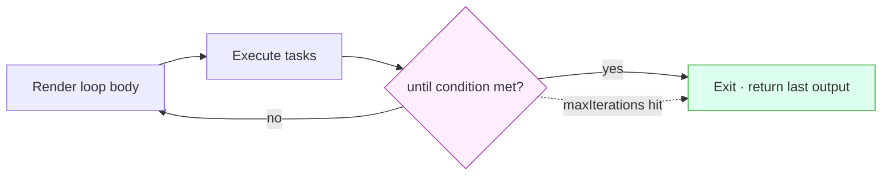
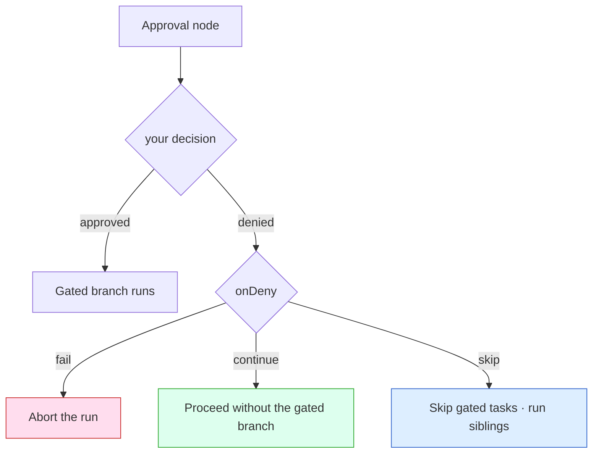

Smithers is a React reconciler whose host elements are tasks instead of DOM nodes.

<Note>API reference: [Types](/reference/types) lists every public type, its fields, and links to source and tests.</Note>

<Frame caption="The whole runtime in one loop: render the tree, extract the ready tasks, execute them, persist their outputs, then re-render against the new state. State is the source of truth; the plan is a pure function of state.">
  
</Frame>

That loop is the entire model: everything below (branching, loops, approvals, resume, time travel) is either a JSX construct affecting rendering or a CLI surface over the persisted state.

## The render loop in detail

1. **Render**. The runtime calls your `smithers((ctx) => ...)` builder. React reconciles the returned JSX tree into a graph of host elements (`smithers:workflow`, `smithers:task`, `smithers:sequence`, `smithers:parallel`, `smithers:branch`, `smithers:loop`, `smithers:approval`, etc.).
2. **Extract**. The runtime walks the tree into a `GraphSnapshot`, a flat list of `TaskDescriptor`s. Each descriptor captures: node id, ordinal, dependencies, output schema, agent, retries, timeouts.
3. **Schedule**. The scheduler computes the ready set: tasks whose dependencies have completed, whose sequence has reached them, whose branch resolved them, and which fit `maxConcurrency`.
4. **Execute**. Each task runs in one of three modes: agent (call the LLM, validate output against the Zod schema, retry on failure), compute (run the function), static (write the literal value).
5. **Persist**. Validated outputs are written to per-schema SQLite tables. Internal `_smithers_*` tables capture node state, attempts, frame snapshots, events, and durable approval/signal state.
6. **Re-render**. The next frame begins with `ctx` reading the updated outputs. Tasks depending on now-completed outputs mount on this frame and become eligible.

The frame is the unit of progress: time travel, observability, hot reload, and resume all key off the frame number.

## The `ctx` API

`ctx` is the only way the workflow body talks to the runtime.

| Method | Returns | Use for |
|---|---|---|
| `ctx.input` | `T` | Immutable input passed to `runWorkflow`. |
| `ctx.outputs(table)` / `ctx.outputs.<key>` | `Row[]` | All rows for an output schema key or target. |
| `ctx.outputMaybe(table, { nodeId, iteration? })` | `Row \| undefined` | Conditional rendering; returns `undefined` until the upstream task completes. |
| `ctx.output(table, { nodeId, iteration? })` | `Row` | Same, but throws if missing. Use inside a Task body where the dep is guaranteed. |
| `ctx.outputRows(output, { nodeId?, scope? })` | `{ payload, nodeId, iteration, seq }[]` | Reads each durable row once in completion order. `seq` is stable across resume, rewind, and fork. |
| `ctx.latest(table, nodeId)` | `Row \| undefined` | A node's highest iteration; used inside `<Loop>` for the previous iteration's output. |
| `ctx.latestArray(value, schema)` | `unknown[]` | Parse a JSON string, scalar, or array and keep entries accepted by `schema.safeParse`. |
| `ctx.iterationCount(table, nodeId)` | `number` | Number of completed iterations for a loop node. |
| `ctx.resolveTableName(table)` / `ctx.resolveRow(table, key)` | `string` / `Row \| undefined` | Low-level helpers for custom table references and exact output lookup. |
| `ctx.runId` / `ctx.iteration` / `ctx.iterations` | `string` / `number` / `Record<string, number> \| undefined` | Identifiers and loop counters for logging and scoped loop reads. |
| `ctx.auth` | `RunAuthContext \| null` | Auth context passed via `RunOptions.auth`. |

Outputs are keyed by `(runId, nodeId, iteration)`. `iteration` is `0` outside loops; inside `<Loop>` each pass writes a new row at the next iteration index.

The `table` argument is the schema key or output target from `createSmithers`
(`"review"` or `outputs.review`), not a raw SQL table name; the runtime resolves
it to the actual persisted table.

## Tasks: three modes

```tsx
// Agent: call an LLM. Children become the prompt; output validated against schema.
<Task id="analyze" output={outputs.analysis} agent={analyst}>
  {`Review ${ctx.input.repo}`}
</Task>

// Compute: children is a function. Runs at execution time.
<Task id="count" output={outputs.count}>
  {() => fs.readdirSync(ctx.input.dir).length}
</Task>

// Static: children is a plain value. Persisted directly.
<Task id="config" output={outputs.config}>
  {{ region: "us-east-1", retries: 3 }}
</Task>
```

If the agent declares `supportsNativeStructuredOutput = true` (`AnthropicAgent`
and `OpenAIAgent` by default), Smithers passes the Zod schema to
`agent.generate({ outputSchema })`, forwarded through the AI SDK's native
structured-output channel (`Output.object({ schema })`). Otherwise (most CLI
agents, including `ClaudeCodeAgent`), Smithers injects JSON instructions into
the prompt, extracts JSON from the text, validates it, and warns about the
fallback. Validation failure feeds the error back into a retry attempt, so
agents self-correct on schema drift.

Agents can be a fallback chain: `agent={[primary, fallback]}` tries `primary` first and falls through on failure.

## Control flow

Four primitives. Compose freely.

```tsx
<Sequence>            // children execute top-to-bottom; default for <Workflow>
<Parallel maxConcurrency={3}>  // children execute concurrently
<Branch if={cond} then={<A/>} else={<B/>}>
<Loop until={done} maxIterations={5} onMaxReached="return-last">
```

An explicit `<Sequence>` is only needed when nesting sequential groups inside `<Parallel>` or another control-flow primitive.

Use `.map()` and ternaries when the *number* or *presence* of tasks depends on state. Use `<Parallel>` and `<Branch>` for fixed task sets whose execution shape depends on state.

`<Loop>` is the one primitive that re-renders the same body repeatedly until `until` holds or `maxIterations` is reached (below). That cycle turns a one-shot agent into one that keeps swinging until the tests are green.



## Data flow is unidirectional

Workflow state lives in SQLite; the render function is a pure function of `ctx` (which reads it). Tasks emit outputs, the runtime persists them, and the next render reads them: no mutation, no refs, no `useState` for durable values.

This is the same shape as React rendering UI from props/state, except:
- the "DOM" is the task graph
- "events" are task completions
- "state updates" are output writes that the runtime triggers

<Frame caption="State is the only source of truth. Task completions update it, and the next plan is a pure function of that state, so you never mutate the plan by hand.">
  
</Frame>

Three consequences:
- The plan is a **derived value**, recomputed on every state change instead of mutated by hand.
- **Time travel works** because every frame is a snapshot of (state → plan).
- **Hot reload works** because reloading the workflow code with the same persisted state produces a new plan; the runtime diffs the two and continues from where you left off.

## Reactivity & React patterns

Smithers JSX is real React. Components, props, children, composition, context, hooks, custom hooks: all work.

```tsx
function useReviewState(ticketId: string) {
  const ctx = useCtx();
  const claudeReview = ctx.latest("review", `${ticketId}:review-claude`);
  return { claudeReview, allApproved: !!claudeReview?.approved };
}
```

`useState` and `useMemo` are process-local: the engine reuses one React root across frames, so hook state survives within a live process but is never persisted; a crash, resume, rewind, or fork starts a fresh process where every hook reinitializes. Use them only for ephemeral render-time state. **Anything the workflow must remember across crashes goes through `ctx` and a Task output.**

Conditional mounting matters: a Task that doesn't render isn't in the plan, with no "skipped" placeholder unless you use `<Branch>` or `skipIf`. That's what lets `{analysis ? <Task .../> : null}` work as a clean dependency check. For one Task consuming one upstream output, `<Task deps={{ analyze: outputs.analysis }}>` with a `(deps) => ...` children callback is the more ergonomic form of the same check.

## Approvals & human-in-the-loop

Two surfaces.

`needsApproval` on a Task is a **gate**: pause before execution, no decision data:

```tsx
<Task id="deploy" output={outputs.deployResult} agent={deployer} needsApproval>
  Deploy to production.
</Task>
```

`<Approval>` is a **decision node**: it produces a typed `ApprovalDecision` row that downstream rendering can branch on:

```tsx
<Approval
  id="ship-decision"
  output={outputs.shipDecision}
  request={{ title: "Ship release v1.4?", summary }}
  onDeny="continue"
/>

{ctx.outputMaybe(outputs.shipDecision, { nodeId: "ship-decision" })?.approved
  ? <Task id="release" .../>
  : <Task id="rollback" .../>}
```

Three denial policies (effects shown below): `"fail"`, `"continue"`, `"skip"`.



Operator side is identical for both (you, the agent, run these on the human's behalf; never hand them to the human):

```bash
bunx smithers-orchestrator ps --status waiting-approval
bunx smithers-orchestrator approve RUN_ID --node ship-decision --by alice
bunx smithers-orchestrator up workflow.tsx --run-id RUN_ID --resume true
```

`<HumanTask>` is for richer interaction: a human submits arbitrary structured JSON. `<EscalationChain>` and `<ApprovalGate>` are higher-level patterns built from these.

## Durability & resume

The contract: **a completed task is never re-executed.** Resume loads persisted state, validates the environment (workflow source hash + VCS revision must match the original run), cleans stale in-progress attempts (>15 min without a heartbeat are abandoned), re-renders, and continues.

```bash
bunx smithers-orchestrator up workflow.tsx --run-id RUN_ID --resume true
```

<Frame caption="A run is killed mid-flight: the completed task is skipped on resume, the interrupted one re-runs as a fresh attempt, and the run finishes from the last persisted frame instead of starting over.">
  
</Frame>

For resume to work, **task IDs must be stable across renders.** Derive them from data, not from indices or timestamps:

```tsx
{tickets.map((t) => <TicketPipeline key={t.id} id={`${t.id}:work`} .../>)}
// NOT id={`work-${i}`} or id={`work-${Date.now()}`}
```

Same rule as React keys. A changed ID looks like a new task to the runtime; a disappeared one is dropped from the plan.

The supervisor auto-resumes runs whose owner process died:

```bash
bunx smithers-orchestrator supervise --all --interval 30s --stale-threshold 1m
```

Standalone supervision requires an explicit scope: pass one or more run IDs with
`--run`, or opt into the workspace-wide sweep with `--all`.

## Session snapshots & fork

Every agent task persists its conversation as a durable session snapshot alongside its output; a later task can start from a **copy** of it with `fork`:

```tsx
<Task id="plan" agent={claude} output={outputs.plan}>Make a plan.</Task>
<Task id="implement" agent={claude} fork="plan" output={outputs.patch}>Implement the plan.</Task>
```

`fork` is immutable: it copies the source conversation into a fresh, independent session, submits the new prompt, and leaves the source untouched, so many tasks can fork it in parallel and a forked task can itself be forked. Reading the snapshot from persisted state on each attempt makes fork resume-safe: the source is never re-executed. Inside a `<Loop>`, `fork` resolves to the latest completed snapshot for that task id. See [`<Task>` fork](/components/task#fork).

## Caching

Per-Task caching with explicit invalidation:

```tsx
<Task
  id="expensive-analysis"
  output={outputs.analysis}
  agent={analyst}
  cache={{
    by: (ctx) => ({ repo: ctx.input.repo, version: "v3" }),
    version: "v3",
  }}
>
  Analyze {ctx.input.repo}
</Task>
```

Cache key = `cache.by(ctx)` + `cache.version` + the schema signature (SHA-256 of the table structure). A schema change invalidates the cache automatically.

Don't cache side-effect tasks (deploys, emails, mutations). Caching is for pure work that's expensive to recompute.

## Time travel

Every frame commit produces a `GraphSnapshot`.

```bash
bunx smithers-orchestrator timeline RUN_ID           # frames + forks
bunx smithers-orchestrator diff RUN_ID NODE_ID     # node DiffBundle
bunx smithers-orchestrator fork workflow.tsx --run-id RUN_ID --frame 5 --reset-node analyze
bunx smithers-orchestrator replay workflow.tsx --run-id RUN_ID --frame 5 --restore-vcs
```

Replay with `--restore-vcs` checks out the jj revision the snapshot was taken at, so re-execution sees the same source code as the original run.

## Scorers (evals)

Attach evaluators to a Task. They run **after** completion and never block.

```tsx
import { schemaAdherenceScorer, latencyScorer } from "smithers-orchestrator/scorers";

<Task
  id="analyze"
  output={outputs.analysis}
  agent={analyst}
  scorers={{
    schema: { scorer: schemaAdherenceScorer() },
    latency: { scorer: latencyScorer({ targetMs: 5000 }) },
  }}
>
  Analyze...
</Task>
```

Five built-ins: `schemaAdherenceScorer`, `latencyScorer`, `relevancyScorer`, `toxicityScorer`, `faithfulnessScorer`. Sampling: `all` / `ratio` / `none`. Custom scorers and LLM-judge scorers with `createScorer` and `llmJudge`.

Five delegation scorers back the [delegation-chain workflow](/workflows/delegation-chain): `pocJudgmentScorer` (probe judgment; false negatives punished hardest), `planSolidityScorer` (post-execution replan churn), `estimateAccuracyScorer` (forecast vs. actual cost/time/tokens), `tierFitScorer` (was the intelligence tier right), and `humanPollScorer` (end-of-run user poll), combined by `delegationRunScore` / `weightedScore`, with `extractDelegationEvents` and `resolvePlanningNodes` as the shared event readers.

Also exported: `runScorersAsync`, `runScorersBatch`, `aggregateScores`, the `smithersScorers` table, token-cost helpers (`modelTokenPrices`, `estimateCostUsd`), and scorer metrics (`scorersStarted`, `scorersFinished`, `scorersFailed`, `scorerDuration`).

Shared by the `eval-suite-run` [seeded workflow](/workflows/eval-suite-run) and the `evals` gateway extension: `parseEvalDataset` (parses a JSON array or JSONL dataset), `evaluateEvalCase` (grades a case's status/output/error against `expected`: an assertion spec of `status`/`output`/`outputContains`/`errorContains`, or a literal value matched by subset/deep-equal), `evalAssertionScorer` (turns a graded case's assertions into a scored row), `evalCaseRunId` (a readable, collision-free child-run id), the `EVAL_CASE_STATUSES` and `EVAL_PASS_THRESHOLD` constants, and the low-level primitives `slugifyEvalToken`, `jsonEquals`, `jsonContains`, `normalizeExpected`, `formatEvalError`, and `isPlainObject`.

```bash
bunx smithers-orchestrator scores RUN_ID
```

## Memory (cross-run state)

Memory is **state that survives across runs**: namespaced facts and message history, not task outputs (which are per-run).

Three layers, four namespaces (`workflow`, `agent`, `user`, `global`). Three processors (`TtlGarbageCollector`, `TokenLimiter`, `Summarizer`). See [the full docs bundle](/llms-full.txt) for the full surface.

## Tools, execution environment & sandboxing

Five built-in tools (`read`, `write`, `edit`, `grep`, `bash`) sandboxed to `rootDir`. Symlinks, network, and timeouts are denied by default; `--allow-network` opens bash to the network.

Least-privilege per task:

```tsx
import { AnthropicAgent } from "smithers-orchestrator";
const analyst     = new AnthropicAgent({ model, instructions: "..." }); // no tools
const reviewer    = new AnthropicAgent({ model, instructions: "...", tools: { read, grep } });
const implementer = new AnthropicAgent({ model, instructions: "...", tools: { read, write, edit, bash } });
```

`defineTool` builds custom tools. Mark side-effecting ones with `sideEffect: true` and use `ctx.idempotencyKey` so retries don't double-fire.

### Where agents run & what's billed

There are **two execution modes**, decided by the agent class, not by a per-turn setting:

- **SDK agents run in-process.** `AnthropicAgent` and `OpenAIAgent` (and `HermesAgent`) extend the AI SDK's `ToolLoopAgent`; the opt-in `ElizaAgent` wraps an elizaOS `AgentRuntime` in-process too. All make plain HTTPS calls to a provider: **no subprocess, no container**, the agent's "environment" is your process. Only these agents run unchanged inside a JS-only serverless runtime (a Cloudflare Worker, a Vercel function).
- **CLI / full-OS agents run as a child process.** `ClaudeCodeAgent`, `CodexAgent`, `OpenCodeAgent`, and every other CLI agent extend `BaseCliAgent`, which spawns the vendor binary via `node:child_process`. **By default that child process runs on the host, in `rootDir`**: the same machine driving the run. There is no automatic per-turn container.

<Note>
  **The default is: no container**, for either mode. A full OS environment is **opt-in** via [`<Sandbox>`](/components/sandbox). Model tokens/subscription, host compute (when local), and sandbox provider compute (when you opt in) are the three cost axes. The full model (including which harnesses are serverless, warm vs cold containers, and the three meanings of "sandbox") is on [Where agents run, sandboxes & cost](/concepts/execution-model).
</Note>

Use `AnthropicAgent`/`OpenAIAgent` for API-billed SDK agents with native
structured output. Use `ClaudeCodeAgent`, `CodexAgent`, and the other CLI
agents for the vendor CLI/subscription surface: they still produce typed task
outputs, via the engine's prompt-and-parse fallback unless the agent documents
a native opt-in.

## Common gotchas

- **Stable task IDs.** `id="implement-${i}"` or `id={Math.random()}` breaks resume. Derive from data.
- **`useState` is not durable.** It survives re-renders within one process but is lost on crash/resume/rewind/fork. Persist via `ctx` and a Task.
- **Input is immutable.** Resuming with different `--input` is an error; the input is persisted at first run.
- **Adding a schema field auto-migrates (SQLite).** On every boot the runtime runs `CREATE TABLE IF NOT EXISTS` and then `ALTER TABLE ... ADD COLUMN` for any column a typed input/output Zod schema introduced, so new fields are added in place without recreating `smithers.db`. If you still see `SQLiteError: table input has no column named X`, you're on a build before this boot-time migration landed (or a Postgres-backed DB, which doesn't auto-add columns yet); upgrade with `bunx smithers-orchestrator --version` or start a fresh run. Renaming or removing a field, or changing its type, isn't migrated and needs a fresh DB.
- **Code changes block resume.** A workflow source change is a different workflow: hot reload applies changes within a running frame, but resume validates the source hash of the original run, and a changed source blocks it. Start a new run instead of resuming across edits.
- **Cached output is re-validated.** Schema drift after caching is caught (the validator rejects the stale row), so the cache misses safely.
- **Side-effect tasks should not be cached.** Pure work only.

The full list, with the fix for each, is in [Common Footguns](/guides/common-footguns).

## Read next

- [Components](/components/workflow): JSX surface reference.
- [CLI](/cli/overview): every command.
- [Recipes](/recipes): patterns from production workflows.
- [Types](/reference/types): public TypeScript surface.
