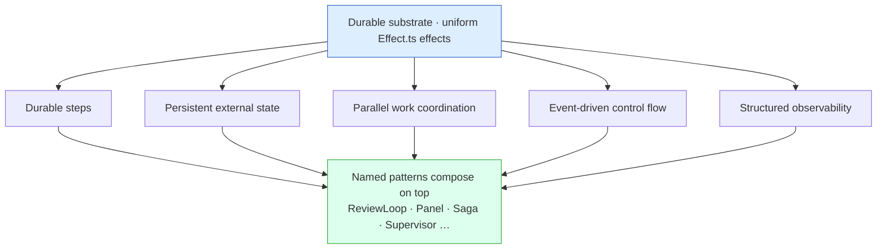
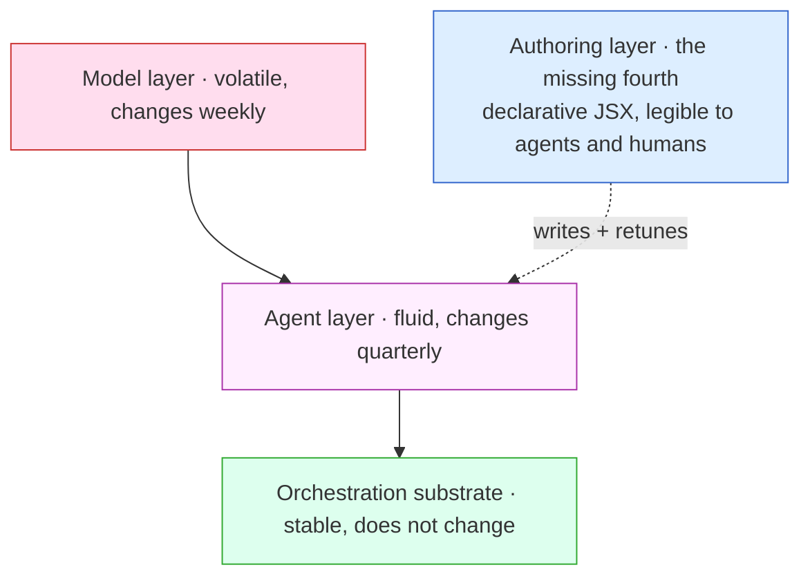

This is a reaction to [Background agents are here. Your orchestration isn't ready.](https://www.inngest.com/blog/background-agents-are-here-your-orchestration-isnt-ready), the sharpest, most forward-looking writing we've seen on the problem Smithers exists to solve: specific lines from it below, and what we'd add to each.

---

## On the treadmill

> Every six months, the "right" way to build an AI agent changes.

> If you coupled your infrastructure to any one of these patterns, you've already rebuilt at least twice. And you'll rebuild again.

The cadence is speeding up beyond humans changing their minds. Wrap a workflow in a self-improving outer loop (the Hermes-shaped thing: one agent watches another's traces and edits the workflow's source) and the meta moves on its own. By next Thursday the workflow your agent runs is one no human author ever wrote.

That raises two problems Smithers exists to solve:

1. **Authoring** a complex workflow from scratch is hard.
2. **Maintaining, changing, and reusing** it as the meta shifts is harder.

Both get dramatically easier by mapping them onto a domain agents are already good at: TypeScript for the language, React (JSX) for the workflow surface.

**TypeScript**, because prompts are template strings.

```ts
const analyst = new AnthropicAgent({ model: "claude-opus-5" });
```

Template strings interpolate, refactor, and get read and edited by models without ceremony. No DSL.

We also support **MDX**: prompt fragments compose like UI components, with typed props:

```mdx
---
inputs:
  repo: string
  sha: string
---

import { RiskAnalysis, OutputSpec } from "./fragments";

# Repo review

Analyze {props.repo} at {props.sha}.

<RiskAnalysis level="thorough" />

<OutputSpec fields={["summary", "risk"]} />
```

**React**, because agents are disproportionately good at writing it: trained on it, fluent in its functional patterns, and legible when humans read what they output. Agents manage complex state machines inside it, debug it, log through it, and review other agents' React. Humans auditing that code are also better at reading React than at simulating an imperative graph in their heads.

The same review workflow as JSX:

```tsx
<Workflow name="review">
  <Sequence>
    <Task id="analyze" output={outputs.analysis} agent={analyst} retries={3}>
      Analyze {ctx.input.repo}@{ctx.input.sha}
    </Task>
    <Task id="report" output={outputs.report}>
      {`# Review\n\n${ctx.outputMaybe(outputs.analysis, { nodeId: 'analyze' })?.summary}`}
    </Task>
  </Sequence>
</Workflow>
```

The payoff: workflows an agent can refactor, extend, or debug without supervision. We took Gstack, an existing high-token agentic workflow, and cut its lines of code by roughly 80% by composing Smithers components instead of hand-writing the orchestration.

---

## On the substrate

> Here's the thesis: there's a layer that doesn't change. Durable orchestration: steps, events, state, retries, observability.

Smithers is that layer: underneath the JSX surface is an Effect.ts runtime, and users who already think in `Effect.gen` can use the lower-level [Effect API](/effect/overview) for full access to the substrate. The same review workflow:

```ts
import { Smithers } from "smithers-orchestrator";
import { Effect, Schema } from "effect";

const G = Smithers.workflow({
  name: "review",
  input: Schema.Struct({ repo: Schema.String, sha: Schema.String }),
});

const analyze = G.step("analyze", {
  output: Schema.Struct({
    summary: Schema.String,
    risk: Schema.Literal("low", "medium", "high"),
  }),
  timeout: "2m",
  retry: { maxAttempts: 3, backoff: "exponential", initialDelay: "1s" },
  run: ({ input, heartbeat, signal }) =>
    Effect.gen(function* () {
      heartbeat({ phase: "analyzing" });
      return yield* analyzeRepo(input, { signal });
    }),
});

const report = G.step("report", {
  needs: { analyze },
  output: Schema.Struct({ markdown: Schema.String }),
  run: ({ analyze }) => ({
    markdown: `# Review\n\n${analyze.summary}`,
  }),
});

const Review = G.from(G.sequence(analyze, report));

await Effect.runPromise(
  Review.execute({ repo: "acme/api", sha: "abc123" }).pipe(
    Effect.provide(Smithers.sqlite({ filename: "smithers.db" })),
  ),
);
```

What you get for free either way: durable persistence (each step's output is decoded against its schema and written to SQLite, so a host crash doesn't replay completed work), default-on retries (LLM APIs fail constantly; you shouldn't hand-write that loop), cancellation propagation, and Effect-native composition with your services, layers, and fibers.

---

## On the framework trap

> Agent frameworks aren't libraries. They're bets on which agent pattern wins. When the pattern shifts, you don't refactor; you rewrite.

The trap is the topology, not the framework: an abstraction over the substrate (durable steps, retries, persistence, suspension, observability) ages fine, while one over the topology (graphs, crews, swarms, role-based agents, conversational multi-agent) ages out as soon as the topology does. The mistake: conflating the two and throwing both away when one expires.

Smithers doesn't pick a topology for you: it hands you a primitive (a durable, retryable, observable task) and lets you compose it into whatever shape your problem and model want this quarter, or this minute.

---

## On abstracting the right thing

> Abstract the primitives: steps, retries, state. Don't abstract the topology.

The test of "did you abstract the primitives well enough" is whether the topologies you keep building can stop being snowflakes.

If your primitives are good, named patterns fall out as compositions, not runtime opinions, and Smithers ships these as components on top of the substrate, never in place of it:

| Component                                                  | What it composes                                                                                 |
| :--------------------------------------------------------- | :----------------------------------------------------------------------------------------------- |
| [`ReviewLoop`](/components/review-loop)                    | Producer + reviewer, loop until approved.                                                        |
| [`Optimizer`](/components/optimizer)                       | Generator + evaluator, loop until score crosses a threshold.                                     |
| [`ScanFixVerify`](/components/scan-fix-verify)             | Scanner finds issues, fixers run in parallel, verifier confirms each fix, retries the survivors. |
| [`Panel`](/components/panel)                               | N specialist reviewers in parallel, moderator synthesizes. Vote, consensus, or synthesize.       |
| [`Debate`](/components/debate)                             | Proposer and opponent argue for N rounds, judge issues a verdict.                                |
| [`GatherAndSynthesize`](/components/gather-and-synthesize) | Fan out to multiple sources in parallel, fan in through a synthesizer.                           |
| [`ClassifyAndRoute`](/components/classify-and-route)       | Classifier sorts items into categories; specialists handle their categories in parallel.         |
| [`EscalationChain`](/components/escalation-chain)          | Try tier 1; escalate to tier 2 if confidence is low, then to a human if needed.                  |
| [`Poller`](/components/poller)                             | Poll an external condition with backoff until satisfied or timed out.                            |
| [`Supervisor`](/components/supervisor)                     | Boss plans, workers execute in parallel, boss reviews and re-delegates failures.                 |
| [`Saga`](/components/saga)                                 | Forward steps with compensations that run in reverse on failure.                                 |

None of these are baked into the runtime; `<ReviewLoop>` is roughly:

```tsx
<Loop until={ctx.latest(outputs.review, 'review')?.approved === true} maxIterations={3}>
  <Sequence>
    <Task id="produce" agent={producer} output={outputs.draft}>
      Produce: {ctx.input.task}
    </Task>
    <Task id="review" agent={reviewer} output={outputs.review}>
      Review the draft: {ctx.outputMaybe(outputs.draft, { nodeId: 'produce' })}
    </Task>
  </Sequence>
</Loop>
```

That's the whole pattern: read the source, fork it, write your own. When the next pattern with no name yet shows up (and it will), compose it from the same primitives, durable and observable for free.

---

## On the five primitives

> Five primitives show up underneath every pattern: durable steps, persistent external state, parallel work coordination, event-driven control flow, structured execution observability.

These are five capabilities the substrate has to provide, not five sealed primitives, delivered in Smithers as uniform Effect.ts effects.

| Capability                | Smithers shape                                                                                                                                                 |
| :------------------------ | :------------------------------------------------------------------------------------------------------------------------------------------------------------- |
| Durable steps             | `<Task>` / `G.step`. Output decoded against a `Schema`, persisted to SQLite.                                                                                   |
| Persistent external state | Every output schema becomes a typed SQLite table, queryable with the SQL tools you already have.                                                                |
| Parallel work             | `<Parallel>` / `G.parallel`. Built on Effect fibers: structured concurrency, interruption, and resource lifetimes behave as expected.                          |
| Event-driven control flow | `<Signal>`, `<WaitForEvent>`, `<Approval>`, `<HumanTask>`. Durably suspend until something happens.                                                            |
| Structured observability  | Prometheus metrics out of the box, plus the SQLite event log. Every state transition, every attempt, every input/output, every retry, every approval is a row. |



A retry policy is just a `Schedule`. A dependency is a `Layer`. A timeout is `Effect.timeout`. We didn't invent a parallel ecosystem; we borrowed one that already does this well.

---

## On background agents

> The next major pattern shift is already happening: from synchronous chat agents to asynchronous background agents. This is where most infrastructure falls apart, and where durable orchestration becomes non-negotiable.

Synchronous chat is forgiving: the user's staring at the screen, retries are free, a five-minute Lambda timeout is fine. Background agents are a different shape: they run for hours, survive deploys, pause for a human approval that won't arrive until tomorrow, and wake back up _at the right step_ when the human finally shows up.

You can build this with a queue and a database, but you'll be reinventing 60% of what Smithers (or any honest durable execution layer) already does, more poorly. In Smithers, it's all one shape:

```tsx
<Workflow name="ship-feature">
  <Task id="implement" agent={engineer} output={outputs.diff}>
    Implement: {ctx.input.spec}
  </Task>
  <Approval
    id="ship"
    output={outputs.shipDecision}
    request={{ title: "Ship this diff?", summary: ctx.outputMaybe(outputs.diff, { nodeId: 'implement' })?.summary }}
    onDeny="fail"
  />
  <Task id="deploy" agent={deployer} output={outputs.deploy}>
    Deploy approved diff.
  </Task>
</Workflow>
```

The `<Approval>` durably suspends the workflow; a reviewer answers tomorrow morning via CLI, web UI, or HTTP. The supervisor (`bunx smithers-orchestrator supervise`) watches for stale heartbeats and resumes runs that died, none of it application code you write.

---

## On sandboxes

> Sandboxes operate at the compute layer: they answer "where does the agent run?" Some pause and resume the full VM state, which is powerful, but it's a runtime snapshot, not a workflow snapshot.

The essay stops one step short of the practical question: do you sandbox the whole graph, each task, or some mix?

In production the answer is "it depends, and we want to change it without rewriting." A single shared sandbox is fine until two parallel agents fight over port 5173 in one end-to-end test, and then you want per-task isolation, or a hybrid where the planner runs in a long-lived sandbox and each implementation step gets its own throwaway one.

Smithers exposes a [`Sandbox`](/components/sandbox) component that runs a child workflow, or a single step, in an isolated runtime: whole-graph, per-step, or mixed, with a pluggable provider.

This is the part of Smithers where we keep changing our mind on the right abstraction: per-task isolation that's clean locally and in the cloud, generic over providers, is hard to nail. Expect this surface to lock down soon.

---

## On conflating layers

> The two layers are complementary, but conflating them is a costly mistake on the road to production.

We've watched teams burn six months on this exact mistake. Sandbox providers solve isolation; orchestration solves "which step is in flight, which is done, which crashed, which is blocked on a human, what the dependency graph is, how to resume." Stack them, don't merge them.

---

## On composability

> Durable orchestration isn't just about reliability. It's about composability.

Composability is what lets the named patterns above exist as libraries instead of runtime opinions, and what lets the workflow author (increasingly an agent) refactor the flow without breaking the substrate.

---

## On the missing fourth layer (and our one disagreement)

> The orchestration layer (stable). The agent layer (fluid). The model layer (volatile).

The three-layer model misses a fourth: the _authoring_ layer. In 2026 a lot of workflow code is written and re-tuned by other agents, so the authoring surface has to be legible both to the agents increasingly editing it and to the humans auditing what they wrote. That's why we picked React, above.



It's also where we have our one real disagreement with the essay: it treats event-driven control flow as a substrate primitive, where events fire, handlers run, and handlers schedule the next thing.

Smithers has the same machinery: callbacks fire on task completion, agent outputs auto-decode and write to SQLite, retries are scheduled by the substrate, and `<Signal>`/`<WaitForEvent>` durably suspend. You can wire events directly to scheduling decisions in the [Effect API](/effect/overview) if you want, but we don't recommend it.

We recommend one-way data flow instead: **events update state; state is the source of truth; the plan is a pure function over state.** New event arrives → SQLite updates → re-render the plan → diff against what's already scheduled → schedule the diff: the same flow React uses for the DOM, applied to a workflow graph.

The reasons are the same ones behind picking React for the authoring surface:

1. **Agents are better at writing declarative trees than imperative graphs**, and the model's JSX-shaped prior shows it: an LLM refactors, extends, and debugs state-driven JSX at a rate no imperative graph matches.
2. **Humans audit declarative trees better too.** A complex JSX tree reads top to bottom, steps and control flow and data flow all visible. Understanding one run of an event-driven graph means mentally simulating which events fire which handlers in what order with what side effects, a cost that grows non-linearly; declarative orchestration stays linear, which matters at 3am when something's gone wrong.

Time travel falls out free (a frame is a snapshot of state; forking from frame N is "throw away rows after this point, re-render"). So does resume (re-render the plan from current state, no event log to replay). So does SQL debuggability (state is queryable, an event chain is not).

The substrate doesn't change; we bet on declarative because it keeps the authoring surface legible to both.

([Why React?](/why-react) is the long version of the JSX argument. [How it works](/how-it-works) is the long version of the state-driven control flow.)

---

## On readiness

> Background agents aren't coming. They're here. The only question is whether your infrastructure is ready to let them run, or whether you're about to rebuild it again.

Our answer is the rest of these docs. Durable steps with retries by default. Prometheus and SQLite observability with no setup. Approval, Signal, HumanTask, Sandbox. Named composition components on top of the substrate, not in place of it. The focused default pack gives agents `create-workflow`, `create-skill`, and `docs-driven-development`; the former starter patterns remain copyable examples. A managed hub if you don't want to run the dashboard yourself.
