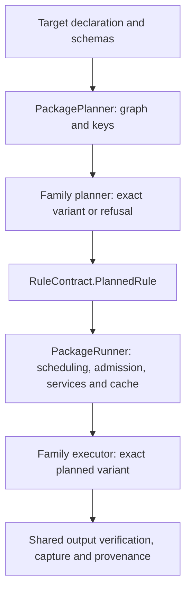

A package target becomes a discriminated planned rule before execution.
`internal/RuleContract.ts` owns that internal union. Its `family`, `rule`,
and `lane` agree: a Fetch carries a URL and digest, a Docs.Check carries its
stamp operands, and a Shell.Serve carries its resolved command and service
probes. An incomplete plan has an explicit refusal. Native rule names cannot
enter the custom declaration-body fallback without their payload.

Fetch, Copy, Literal, and Docs.Check have paired planners and executors in
`internal/rules`. `NativeRules` selects the pair from one registry. Fetch
requires exactly one output, execute mode, and intrinsic network access;
native file rules require one output; Docs.Check carries its resolved input
closure. Process rules require a nonempty resolved command. The union also
enforces the remaining rule/lane and agent-flavor relationships.

## Execution boundaries

The Fetch pair is `internal/rules/FetchPlan.ts` and
`internal/rules/FetchExecutor.ts`, joined by `FetchRule.contract`.
The planner resolves the package-relative output without network or filesystem
access. The executor reads the planned URL, digest, and destination; it does
not read the declaration again. It streams into a temporary file, verifies
the digest, and publishes by rename using the existing limits and errors.

`PackageExec.ts` is the public facade. `PackagePlanner` owns graph expansion,
input resolution, and preview keys. `PackageRunner` owns admission, service
acquisition, execution, output verification, and cache publication. Its
artifact lifecycle restores before running and captures only a successful
result. `RulePolicy` declares each rule's default mode, cache eligibility,
capabilities, and scheduling flags in one place. `ServiceSupervisor` owns
service lifetimes; extracting a rule introduces no new scheduler or cache.

The public `FetchExec` functions remain adapters to the same planner and
download implementation. Its error class, limits, result type, and URL
redactor are reexports of their single implementation owner. There is no
second download path. Other public declaration constructors and schemas are
unchanged. Schema checks at declaration and persisted-cache boundaries and
runtime refusal on unsupported hosts remain necessary; the internal union
does not validate untyped or serialized values.

## Semantic owners

| Concept                                              | Owner                                         | Adapters and deliberately distinct views                                                                                                                                           |
| ---------------------------------------------------- | --------------------------------------------- | ---------------------------------------------------------------------------------------------------------------------------------------------------------------------------------- |
| Target declarations, attrs and declared outputs      | `@smthrs/targets/Target` and each rule schema | `TargetExecution` lowers a declaration body with `Target.plan` inside an executor-owned Flow. Native package rules use their planned family.                                       |
| Planned rule payloads and shared package node fields | `internal/RuleContract`                       | `PackageExec.PackageNode`, `Mode`, `LaneData`, `CrateRow`, and `TestOperandPlan` are aliases, not duplicate definitions.                                                           |
| Declared file inputs and digests                     | `@smthrs/targets/Input`                       | `Workspace.ExpandedInput` is the anchored, expanded planner view. It is not another declaration schema.                                                                            |
| Package dependency reasons                           | `PackageIndex.Edge`                           | `Planner.Edge` is the scheduler's direction and label projection. The mapping stays explicit because declaration edges distinguish data, tools, and services.                      |
| Build key material and encoding                      | `Planner`                                     | Package planning contributes rule attrs and resolved facts. Durable Flow topology and journal identity remain owned by their respective packages.                                  |
| Resolved environment                                 | `NixExec.ResolvedEnvironment`                 | `Planner.PlannedEnvironment` projects the store path, hash, closure, PATH, and variables needed at execution; resolver diagnostics and declaration facts are intentionally absent. |
| Fetch planning and transport                         | `FetchPlan` and `FetchExecutor`               | `FetchRule` pairs them; `FetchExec` preserves the public call shape without duplicating behavior.                                                                                  |
| Process service lifetime                             | `ServiceSupervisor`                           | Declaration probe schemas validate attrs. The supervisor's host-facing readiness, health, and stop types describe the reduced runtime contract.                                    |
| Output manifests and workspace snapshots             | `PackageTree`                                 | `Cache` owns the persisted entry envelope and content store. `PackageRunner` decides when an entry is reusable and when to publish provenance.                                     |

`CoreRuleSelection` is a temporary adapter for the core rules still planned
inline. Its native-lane name table is checked against the union at compile
time, so adding a native variant also requires guarding the body fallback.
The remaining specialized dispatch stays in `PackagePlanner` and
`PackageRunner`, behind the same shared policy and scheduler. New native
families should join `NativeRules` with a paired contract instead of adding
independent planning and execution cases.

## Equivalence and coverage

`FetchRuleEquivalence.test.ts` retains goldens recorded before extraction:
complete semantic key material, report, cache provenance, output bytes and
mode, replay after deletion, and bypassed cache reads. Only ambient host
identity, the implementation fingerprint, timestamps, and the local HTTP
fixture's port are normalized. Production still fingerprints the changed
implementation; existing key-format salts and stored records are unchanged.

`FetchRuleContract.test.ts` checks the exact executor against the public
adapter, output-path refusals, typed failures with original causes,
cancellation, and byte limits at N-1, N, and N+1. `PlannedRule.types.ts`
contains negative compilation tests for invalid rule/lane, command,
output, service, and execution-policy combinations.

The original PackageExec coverage floor also gates the combined extracted
planner, runner, policy, and native rule modules. Moving code does not remove
it from the gate. Existing per-backend floors remain in place.

## Current scheduler and dispatch owners

`Executor` owns `schedule`, `mergePlans`,
concurrency validation, report types, and the cache-output codecs.
`PackageRunner.execute`, reexported by `PackageExec`, coordinates rule dispatch, cache decisions, services,
and output capture, calling that shared scheduler. `TargetExecution.runTarget`
is the adapter that lowers declaration bodies into the isolated Flow runtime.
There is no second rule-dispatch loop in `Executor` to extract.

The remaining convergence work is between native family execution and that
declaration-body adapter. Their different input contracts still justify an
explicit boundary while each native family earns its own equivalence evidence.
